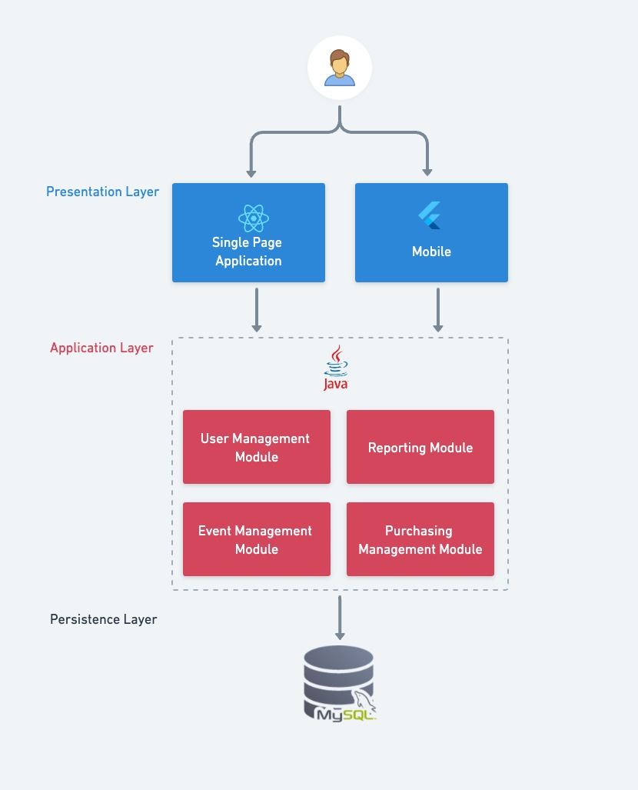
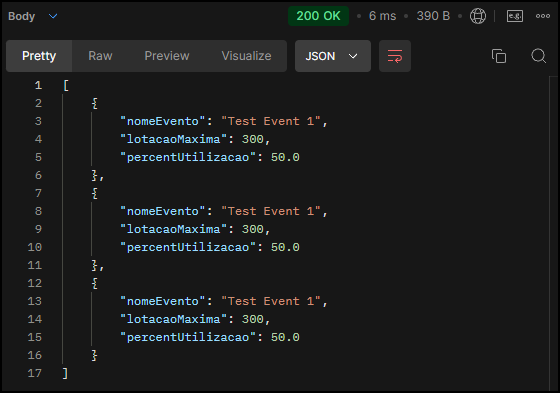
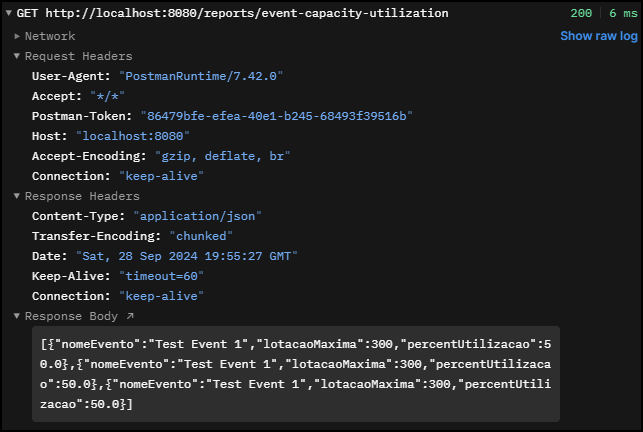
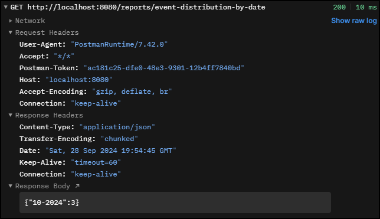
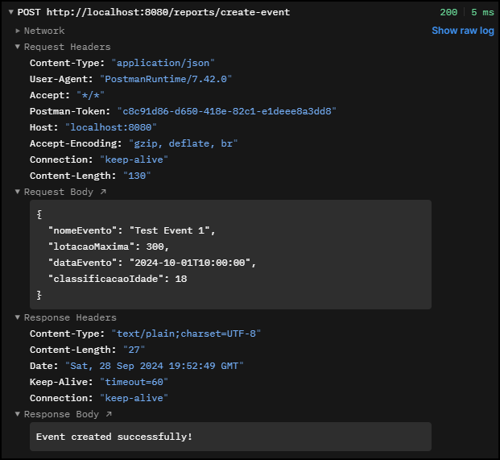
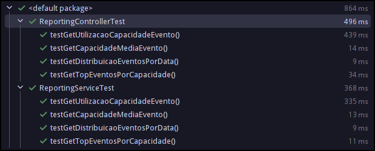

# APIs e Web Services
!(Repositório TickTag)[https://github.com/sales-victor/TickTag/]

Uma API para gestão de eventos e emissão de ingressos é projetada para facilitar o gerenciamento de eventos, desde o cadastro até a emissão de ingressos. Com essa API, os organizadores podem registrar eventos, definir detalhes como data, local, capacidade, e tipos de ingressos. Ela permite o controle de lotação, a emissão e o envio de ingressos, além de oferecer funcionalidades para a gestão de participantes, como check-ins e validação de ingressos. 

Focada em ser segura e escalável, a API é ideal para diversos tipos de eventos, proporcionando uma interface intuitiva para organizadores e participantes, otimizando o controle e a operação do evento.

## Objetivos da API

Os principais objetivos da API de gestão de eventos e emissão de ingressos são:

- **Facilitar o Gerenciamento de Eventos**: Permitir que organizadores registrem e atualizem informações de eventos de forma simples, incluindo detalhes como data, local, lotação, e tipos de ingressos disponíveis.

- **Emitir e Gerenciar Ingressos**: Oferecer funcionalidades para a emissão, controle e validação de ingressos, possibilitando o gerenciamento eficiente dos participantes e garantindo que a lotação dos eventos seja respeitada.

- **Controlar Check-ins e Presenças**: Integrar funcionalidades de check-in para a validação de ingressos na entrada dos eventos, otimizando o controle de acesso e a segurança.

- **Fornecer Relatórios e Estatísticas**: Disponibilizar dados em tempo real sobre o status dos ingressos emitidos, lotação, e outras métricas relevantes para ajudar na tomada de decisões.

- **Segurança e Escalabilidade**: Garantir que a API seja segura, com autenticação e controle de acesso, e que suporte o crescimento da demanda, podendo ser utilizada em eventos de diferentes portes.

- **Uso Interno e Externo**: Ser utilizada tanto por aplicações internas de gerenciamento quanto por parceiros externos que desejem integrar suas próprias soluções de gestão de eventos, expandindo o alcance e a funcionalidade do sistema.

## Arquitetura



## Modelagem da Aplicação


## Fluxo de Dados

[Diagrama ou descrição do fluxo de dados na aplicação.]

## Requisitos Funcionais

| ID     | Descrição do Requisito                          | 
| ------ | ----------------------------------------------- | 
| RF-001 | Gestão de usuários                              | 
| RF-002 | Mecanismos de Gestão de Relatórios              |
| RF-003 | Mecanismo de Gestão de Compras                  | 
| RF-004 | Mecanismo de Gestão de Eventos                  | 

## Requisitos Não Funcionais

| ID      | Descrição do Requisito                                                                                                                    | 
| ------- | ----------------------------------------------------------------------------------------------------------------------------------------- | 
| RNF-001 | A aplicaçã deve utilizar o autenticador JWT                                                                                               | 
| RNF-002 | A aplicação deve utilizar banco de dados relacional.                                     | 
| RNF-003 |A aplicação deve ser otimizada para proporcionar tempos de resposta rápidos, com um tempo de carregamento de página inferior a 2 segundos. | 

## Tecnologias Utilizadas

As principais tecnologias utilizadas no desenvolvimento da API para gestão de eventos e emissão de ingressos são:

 - **Java**: Linguagem de programação robusta e amplamente utilizada para desenvolvimento de aplicações de backend, oferecendo alta performance e segurança.
  
 - **Spring Boot**: Framework que facilita a criação de aplicações Java, fornecendo uma estrutura modular e escalável, ideal para o desenvolvimento de APIs RESTful.

 - **Swagger**: Ferramenta para documentação e design de APIs, que permite a criação de especificações claras e interativas, facilitando a integração e o uso da API por desenvolvedores externos.
  
 - **Hibernate**: Framework de ORM (Object-Relational Mapping) que simplifica a interação com bancos de dados, reduzindo a complexidade do código SQL e melhorando a eficiência no gerenciamento de dados.
  
 - **PostgreSQL**: Sistema de gerenciamento de banco de dados relacional, conhecido por sua robustez, escalabilidade e conformidade com padrões SQL, ideal para armazenar e gerenciar os dados dos eventos e ingressos.
   
 - **JWT (JSON Web Tokens)**: Tecnologia utilizada para autenticação e autorização, proporcionando uma forma segura e eficiente de gerenciar sessões de usuários, garantindo que apenas usuários autenticados acessem os recursos da API.
   
Essas tecnologias foram escolhidas pela sua confiabilidade, eficiência e capacidade de suportar o crescimento da aplicação, garantindo uma API escalável e de fácil manutenção.

## API Endpoints

```{
  "openapi": "3.0.1",
  "info": {
    "title": "API TickTag",
    "description": "Serviço relacionados a gestão de tickets",
    "termsOfService": "",
    "license": {
      "name": "Apache 2.0",
      "url": ""
    },
    "version": "v1"
  },
  "servers": [
    {
      "url": "http://localhost:8080",
      "description": "Generated server url"
    }
  ],
  "paths": {
    "/evento": {
      "get": {
        "tags": [
          "evento-rest-ctr"
        ],
        "operationId": "findAll",
        "responses": {
          "200": {
            "description": "OK",
            "content": {
              "*/*": {
                "schema": {
                  "$ref": "#/components/schemas/ApiResponseListEventoVO"
                }
              }
            }
          }
        }
      },
      "put": {
        "tags": [
          "evento-rest-ctr"
        ],
        "operationId": "update",
        "requestBody": {
          "content": {
            "application/json": {
              "schema": {
                "$ref": "#/components/schemas/EventoVO"
              }
            }
          },
          "required": true
        },
        "responses": {
          "200": {
            "description": "OK",
            "content": {
              "*/*": {
                "schema": {
                  "$ref": "#/components/schemas/ApiResponseEventoVO"
                }
              }
            }
          }
        }
      },
      "post": {
        "tags": [
          "evento-rest-ctr"
        ],
        "operationId": "save",
        "requestBody": {
          "content": {
            "application/json": {
              "schema": {
                "$ref": "#/components/schemas/EventoVO"
              }
            }
          },
          "required": true
        },
        "responses": {
          "200": {
            "description": "OK",
            "content": {
              "*/*": {
                "schema": {
                  "$ref": "#/components/schemas/ApiResponseEventoVO"
                }
              }
            }
          }
        }
      }
    },
    "/reports/top-events-by-capacity": {
      "get": {
        "tags": [
          "reporting-controller"
        ],
        "operationId": "getTopEventosPorCapacidade",
        "parameters": [
          {
            "name": "limit",
            "in": "query",
            "required": true,
            "schema": {
              "type": "integer",
              "format": "int32"
            }
          }
        ],
        "responses": {
          "200": {
            "description": "OK",
            "content": {
              "*/*": {
                "schema": {
                  "type": "array",
                  "items": {
                    "type": "object",
                    "additionalProperties": {
                      "type": "object"
                    }
                  }
                }
              }
            }
          }
        }
      }
    },
    "/reports/event-distribution-by-date": {
      "get": {
        "tags": [
          "reporting-controller"
        ],
        "operationId": "getDistribuicaoEventosPorData",
        "responses": {
          "200": {
            "description": "OK",
            "content": {
              "*/*": {
                "schema": {
                  "type": "object",
                  "additionalProperties": {
                    "type": "integer",
                    "format": "int64"
                  }
                }
              }
            }
          }
        }
      }
    },
    "/reports/event-capacity-utilization": {
      "get": {
        "tags": [
          "reporting-controller"
        ],
        "operationId": "getUtilizacaoCapacidadeEvento",
        "responses": {
          "200": {
            "description": "OK",
            "content": {
              "*/*": {
                "schema": {
                  "type": "array",
                  "items": {
                    "type": "object",
                    "additionalProperties": {
                      "type": "object"
                    }
                  }
                }
              }
            }
          }
        }
      }
    },
    "/reports/event-age-classification-breakdown": {
      "get": {
        "tags": [
          "reporting-controller"
        ],
        "operationId": "getClassificacaoEtariaEventos",
        "responses": {
          "200": {
            "description": "OK",
            "content": {
              "*/*": {
                "schema": {
                  "type": "object",
                  "additionalProperties": {
                    "type": "integer",
                    "format": "int64"
                  }
                }
              }
            }
          }
        }
      }
    },
    "/reports/average-event-capacity": {
      "get": {
        "tags": [
          "reporting-controller"
        ],
        "operationId": "getCapacidadeMediaEvento",
        "responses": {
          "200": {
            "description": "OK",
            "content": {
              "*/*": {
                "schema": {
                  "type": "object",
                  "additionalProperties": {
                    "type": "object"
                  }
                }
              }
            }
          }
        }
      }
    },
    "/evento/id/{idEvento}": {
      "get": {
        "tags": [
          "evento-rest-ctr"
        ],
        "operationId": "findById",
        "parameters": [
          {
            "name": "idEvento",
            "in": "path",
            "required": true,
            "schema": {
              "type": "integer",
              "format": "int64"
            }
          }
        ],
        "responses": {
          "200": {
            "description": "OK",
            "content": {
              "*/*": {
                "schema": {
                  "$ref": "#/components/schemas/ApiResponseEventoVO"
                }
              }
            }
          }
        }
      }
    },
    "/evento/filtro": {
      "get": {
        "tags": [
          "evento-rest-ctr"
        ],
        "operationId": "findByParams",
        "parameters": [
          {
            "name": "filter",
            "in": "query",
            "required": true,
            "schema": {
              "$ref": "#/components/schemas/EventoFilterDTO"
            }
          }
        ],
        "responses": {
          "200": {
            "description": "OK",
            "content": {
              "*/*": {
                "schema": {
                  "$ref": "#/components/schemas/ApiResponseListEventoVO"
                }
              }
            }
          }
        }
      }
    },
    "/evento/{idEvento}": {
      "delete": {
        "tags": [
          "evento-rest-ctr"
        ],
        "operationId": "deleteById",
        "parameters": [
          {
            "name": "idEvento",
            "in": "path",
            "required": true,
            "schema": {
              "type": "integer",
              "format": "int64"
            }
          }
        ],
        "responses": {
          "200": {
            "description": "OK",
            "content": {
              "*/*": {
                "schema": {
                  "$ref": "#/components/schemas/ApiResponseString"
                }
              }
            }
          }
        }
      }
    }
  },
  "components": {
    "schemas": {
      "EnderecoVO": {
        "type": "object",
        "properties": {
          "id": {
            "type": "integer",
            "format": "int64"
          },
          "idEvento": {
            "type": "integer",
            "format": "int64"
          },
          "nomeLogradouro": {
            "type": "string"
          },
          "tipoLogradouro": {
            "type": "string"
          },
          "numero": {
            "type": "integer",
            "format": "int64"
          },
          "complemento": {
            "type": "string"
          },
          "bairro": {
            "type": "string"
          },
          "cidade": {
            "type": "string"
          },
          "uf": {
            "type": "string"
          },
          "nomeEspaco": {
            "type": "string"
          }
        }
      },
      "EventoVO": {
        "type": "object",
        "properties": {
          "id": {
            "type": "integer",
            "format": "int64"
          },
          "nomeEvento": {
            "type": "string"
          },
          "statusEvento": {
            "type": "string"
          },
          "dataEvento": {
            "type": "string",
            "format": "date-time"
          },
          "enderecoVO": {
            "$ref": "#/components/schemas/EnderecoVO"
          },
          "tickets": {
            "uniqueItems": true,
            "type": "array",
            "items": {
              "$ref": "#/components/schemas/TipoTicketVO"
            }
          },
          "lotacaoMaxima": {
            "type": "integer",
            "format": "int64"
          },
          "classificacaoIdade": {
            "type": "integer",
            "format": "int64"
          }
        }
      },
      "TipoTicketVO": {
        "type": "object",
        "properties": {
          "id": {
            "type": "integer",
            "format": "int64"
          },
          "idEvento": {
            "type": "integer",
            "format": "int64"
          },
          "lote": {
            "type": "integer",
            "format": "int64"
          },
          "qtdLote": {
            "type": "integer",
            "format": "int64"
          },
          "valorTicket": {
            "type": "number",
            "format": "double"
          },
          "valorMeiaTicket": {
            "type": "number",
            "format": "double"
          },
          "tipoTicket": {
            "type": "string"
          },
          "statusTicket": {
            "type": "string"
          }
        }
      },
      "ApiResponseEventoVO": {
        "type": "object",
        "properties": {
          "statusCode": {
            "type": "integer",
            "format": "int32"
          },
          "message": {
            "type": "string"
          },
          "data": {
            "$ref": "#/components/schemas/EventoVO"
          }
        }
      },
      "ApiResponseListEventoVO": {
        "type": "object",
        "properties": {
          "statusCode": {
            "type": "integer",
            "format": "int32"
          },
          "message": {
            "type": "string"
          },
          "data": {
            "type": "array",
            "items": {
              "$ref": "#/components/schemas/EventoVO"
            }
          }
        }
      },
      "EventoFilterDTO": {
        "type": "object",
        "properties": {
          "nomeEvento": {
            "type": "string"
          },
          "statusEvento": {
            "type": "string"
          },
          "dataEvento": {
            "type": "string",
            "format": "date-time"
          },
          "classificacaoIdade": {
            "type": "integer",
            "format": "int64"
          },
          "lotacaoMaxima": {
            "type": "integer",
            "format": "int64"
          }
        }
      },
      "ApiResponseString": {
        "type": "object",
        "properties": {
          "statusCode": {
            "type": "integer",
            "format": "int32"
          },
          "message": {
            "type": "string"
          },
          "data": {
            "type": "string"
          }
        }
      }
    }
  }
}
```


## Considerações de Segurança

A segurança da API de gestão de eventos e emissão de ingressos será garantida principalmente através do uso de JWT (JSON Web Tokens), que proporciona uma forma simples e eficaz de autenticação e autorização. As principais considerações de segurança incluem:

- **Autenticação com JWT**: JWT será utilizado para autenticar usuários, gerando tokens seguros que contêm as credenciais e permissões do usuário. Esses tokens serão incluídos nas requisições à API, garantindo que apenas usuários autenticados possam acessar os recursos.

- **Autorização de Acesso**: O JWT também será responsável por controlar as permissões de acesso dos usuários, verificando se o token inclui as credenciais necessárias para a execução de operações específicas, como emissão de ingressos ou acesso a relatórios.

 - **Expiração de Tokens**: Os tokens terão uma data de expiração para limitar o tempo de sessão e reduzir o risco de uso indevido, exigindo que os usuários se autentiquem novamente após o vencimento do token.

 - **Proteção dos Dados do Token**: Os JWTs serão assinados para garantir que não possam ser alterados ou forjados, proporcionando uma camada adicional de segurança e autenticidade.

Essas medidas, centradas no uso de JWT, garantem uma autenticação e autorização simples e eficaz, adequadas para as necessidades da API sem complexidade adicional.

## Implantação

[Instruções para implantar a aplicação distribuída em um ambiente de produção.]

1. Defina os requisitos de hardware e software necessários para implantar a aplicação em um ambiente de produção.
2. Escolha uma plataforma de hospedagem adequada, como um provedor de nuvem ou um servidor dedicado.
3. Configure o ambiente de implantação, incluindo a instalação de dependências e configuração de variáveis de ambiente.
4. Faça o deploy da aplicação no ambiente escolhido, seguindo as instruções específicas da plataforma de hospedagem.
5. Realize testes para garantir que a aplicação esteja funcionando corretamente no ambiente de produção.

## Testes

A estratégia de testes para a API de gestão de eventos e emissão de ingressos foi desenhada com foco na cobertura dos requisitos funcionais e na validação da integração entre componentes. Os principais tipos de testes realizados foram unitários e de integração, enquanto testes de carga e automação não foram implementados nesta fase.

### Estratégia de Teste

1. **Criação de Casos de Teste**: Foram criados casos de teste para cobrir todos os requisitos funcionais da API, garantindo que as operações básicas de criação, atualização, exclusão e recuperação de dados funcionem conforme esperado.
   
2. **Testes Unitários**: Testes foram implementados para validar funcionalidades isoladas, como as operações de relatórios e a manipulação de dados de eventos. A biblioteca Mockito foi utilizada para simular interações com o repositório de dados e outros componentes, permitindo testar o comportamento das funções de maneira eficiente. *Exemplo de teste unitário*:
```java
@Test
public void testGetUtilizacaoCapacidadeEvento() {
    // Mokca o repositório
    EventoVO event1 = new EventoVO();
    event1.setNomeEvento("Event 1");
    event1.setLotacaoMaxima(100L);

    when(eventoRepository.findAll()).thenReturn(List.of(event1));

    // Chama o serviço
    List<Map<String, Object>> result = reportingService.getUtilizacaoCapacidadeEvento();

    // Valida resultado
    assertEquals("Event 1", result.get(0).get("nomeEvento"));
}
```
3. **Testes de Integração**: Foram realizados testes para validar a integração entre os controladores da API e o serviço de relatórios, utilizando o MockMvc do Spring Boot. Os testes simularam requisições HTTP e validaram a resposta JSON, garantindo que a API funcione corretamente quando integrada com os serviços internos. *Exemplo de teste de integração*:
```java
@Test
public void testGetTopEventosPorCapacidade() throws Exception {
    // Mocka a resposta
    when(reportingService.getTopEventosPorCapacidade(2)).thenReturn(mockResponse);

    // Solicitacao GET
    mockMvc.perform(get("/reports/top-events-by-capacity?limit=2"))
           .andExpect(status().isOk())
           .andExpect(jsonPath("$[0].nomeEvento").value("Event 1"));
}
```
4. **Testes de Carga**: Não foram realizados testes de carga nesta fase. Este tipo de teste pode ser implementado posteriormente para avaliar o desempenho da API sob alto tráfego e garantir tempos de resposta adequados.
5. **Ferramentas Utilizadas**: As ferramentas principais utilizadas foram:
 - **JUnit 5** para testes unitários.
 - **Mockito** para criar mocks e simular comportamentos em testes unitários.
 - **MockMvc** para realizar testes de integração, simulando chamadas HTTP na API.

### Resultado

As imagens a seguir mostram as requisições e respostas HTTP para os endpoints testados, demonstrando o comportamento da API em diferentes cenários.

#### 1. Utilização de Capacidade de Eventos
Esta requisição foi feita ao endpoint `/reports/event-capacity-utilization`, retornando a utilização da capacidade dos eventos.




#### 2. Distribuição de Eventos por Data
Aqui, vemos a distribuição de eventos por data a partir do endpoint `/reports/event-distribution-by-date`.



#### 3. Criação de Eventos
A requisição abaixo mostra a criação de um evento no endpoint `/reports/create-event`, com a resposta de sucesso.



#### 4. Testes unitários

Os testes unitários cobriram diversas funcionalidades da API, verificando individualmente a lógica de cada serviço. A imagem a seguir mostra os resultados dos testes, indicando que todas as funções testadas passaram.



# Referências

* [REST API's RESTFul do 0 à AWS c. Spring Boot 3](https://www.udemy.com/course/restful-apis-do-0-a-nuvem-com-springboot-e-docker/?kw=Api+restful&src=sac&couponCode=24T4MT92724A)
