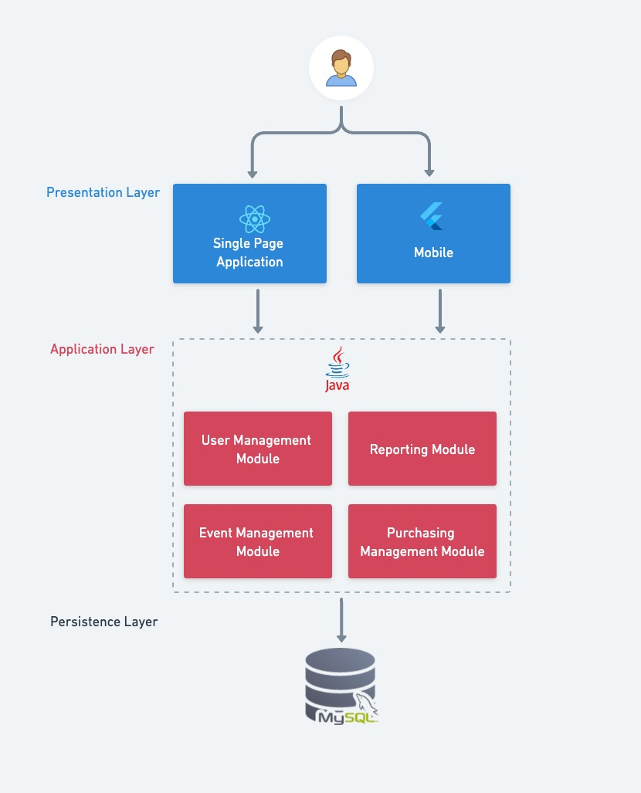

# Introdução

A transformação digital tem sido uma força motriz na modernização da sociedade, especialmente no que diz respeito às compras e agendamentos online. Fatores como praticidade, comodidade e competitividade de preços são os principais impulsionadores dessa tendência, atraindo um número crescente de consumidores para o ambiente digital (Gouvêa, Oliveira e Nakagawa, 2013). No setor de entretenimento, essa mudança é particularmente evidente na compra de ingressos para eventos, onde a demanda por soluções ágeis e eficientes tem se intensificado.

A evolução tecnológica não apenas minimiza problemas tradicionais, como longas filas e a necessidade de deslocamento até pontos de venda físicos, mas também oferece uma série de vantagens tanto para os consumidores quanto para os empreendedores. Para os clientes, a conveniência de adquirir ingressos de forma rápida e segura, a qualquer hora e de qualquer lugar, é um diferencial significativo. Já para os empreendedores, o uso de plataformas digitais permite a redução substancial de custos operacionais, associados à manutenção de infraestrutura física e à segurança nos pontos de venda.

Além disso, o avanço das tecnologias de processamento e distribuição de dados, como computação em nuvem e arquiteturas escaláveis, tem possibilitado que plataformas de vendas online suportem um grande volume de transações simultâneas, garantindo uma experiência fluida e sem interrupções para o usuário final. Isso é crucial em períodos de alta demanda, como a venda de ingressos para grandes shows ou eventos esportivos, onde o tempo de resposta e a disponibilidade do serviço são fatores críticos para o sucesso.

Dados de uma pesquisa da Forbes Brasil em 2023 indicam que 63% dos entrevistados já preferem realizar compras em lojas virtuais, com uma projeção de crescimento de 54% para o ano seguinte. Esses números refletem a crescente confiança dos brasileiros nos meios digitais, o que deverá impactar significativamente as vendas de ingressos para eventos. Com a expectativa de que essa preferência continue a crescer, é essencial que plataformas de venda de ingressos estejam preparadas para atender à demanda crescente, garantindo uma experiência de compra eficiente e confiável.

- [Procura recorde por ingressos de tour de Taylor Swift faz Ticketmaster cancelar vendas](https://www.cnnbrasil.com.br/entretenimento/procura-recorde-por-ingressos-de-tour-de-taylor-swift-faz-ticketmaster-cancelar-vendas/)

- [Rock in Rio 2024: ingressos da pré-venda esgotam em tempo recorde](https://cultura.uol.com.br/entretenimento/noticias/2024/05/20/10343_rock-in-rio-2024-ingressos-na-pre-venda-esgotam-em-tempo-recorde.html)

## Problema

O aumento exponencial na realização de eventos culturais, esportivos, shows e outras atividades de entretenimento tem gerado uma demanda crescente por sistemas de venda de ingressos online. Com essa expansão, surge a necessidade de desenvolver soluções de software que possam garantir vantagens significativas, como alta disponibilidade e escalabilidade. Esses aspectos são cruciais para assegurar que a plataforma possa lidar eficientemente com grandes volumes de acessos simultâneos, especialmente durante períodos de alta demanda, como a abertura de vendas para eventos populares.

A indisponibilidade ou lentidão em sistemas de vendas online pode resultar em perda de receita, insatisfação do cliente e até mesmo danos à reputação da empresa. Portanto, a capacidade de escalar recursos de maneira dinâmica, para atender a picos de tráfego, e garantir a continuidade do serviço sem interrupções, é fundamental. Além disso, a implementação de estratégias de balanceamento de carga e redundância pode ajudar a distribuir o tráfego de maneira eficiente, minimizando o risco de sobrecarga e falhas no sistema.

Esses desafios evidenciam a importância de uma arquitetura de software robusta e flexível, capaz de atender às exigências de um mercado em constante crescimento e evolução.

## Objetivos

**Geral**: 
  - Desenvolver uma plataforma de venda de tickets online eficiente e escalável que permita a compra e gerenciamento de ingressos para eventos culturais, esportivos e de entretenimento, oferecendo uma experiência de usuário intuitiva e segura.

**Específicos**:
  - Implementar um sistema de balanceamento de carga e escalabilidade que permita à aplicação gerenciar grandes volumes de acessos simultâneos, garantindo desempenho consistente e alta disponibilidade durante períodos de alta demanda.
  - Implementar um design responsivo e adaptativo que proporcione uma experiência de usuário otimizada em dispositivos móveis e desktops, garantindo que a aplicação seja totalmente funcional e visualmente atraente em diferentes tamanhos de tela e resoluções.

## Justificativa

A escolha de desenvolver uma aplicação de venda de tickets online é motivada pela crescente demanda por soluções tecnológicas que acompanhem a evolução do mercado de entretenimento. Com o aumento significativo na realização de eventos culturais, esportivos e shows, as plataformas de venda de ingressos enfrentam desafios crescentes relacionados à escalabilidade, disponibilidade e experiência do usuário. A transformação digital trouxe novas expectativas por parte dos consumidores, que agora exigem processos de compra rápidos, seguros e acessíveis a qualquer momento e de qualquer lugar.

Trabalhar com essa aplicação específica é essencial não apenas para atender às demandas atuais, mas também para preparar o sistema para o futuro, onde o volume de transações online tende a crescer ainda mais. A implementação de uma arquitetura de software que possa escalar eficientemente e garantir alta disponibilidade é fundamental para evitar perdas financeiras e manter a satisfação do cliente. Além disso, focar em aspectos como a otimização de desempenho, segurança de dados e facilidade de uso são pilares que sustentam o sucesso de qualquer plataforma digital de vendas.

Ao aprofundar o desenvolvimento em áreas específicas, como a implementação de mecanismos de balanceamento de carga e a utilização de infraestruturas em nuvem, busca-se não apenas criar uma solução eficiente, mas também oferecer uma experiência superior ao usuário final. Essas escolhas são impulsionadas pela necessidade de inovar e garantir que a plataforma possa competir em um mercado cada vez mais competitivo, onde a capacidade de atender grandes volumes de acessos simultâneos pode ser o diferencial entre o sucesso e o fracasso.

A justificativa para esse projeto está enraizada na importância de criar uma solução robusta e escalável, capaz de atender tanto às necessidades imediatas quanto às futuras, proporcionando um serviço confiável e de alta qualidade para os usuários. Ao investir nesse desenvolvimento, estamos não apenas acompanhando as tendências do mercado, mas também contribuindo para a evolução tecnológica e a melhoria contínua das plataformas de vendas online.

## Público-Alvo

O público-alvo desta aplicação de venda de tickets online abrange tanto consumidores finais quanto organizadores de eventos. Entre os consumidores, estão pessoas de diferentes faixas etárias e perfis que buscam adquirir ingressos de forma rápida, segura e conveniente, seja para shows, eventos esportivos, peças de teatro ou qualquer outro tipo de evento. Esses usuários valorizam a praticidade de realizar compras online, especialmente em plataformas que ofereçam uma experiência de usuário intuitiva e eficiente.

Além dos consumidores, a aplicação também é direcionada a organizadores e promotores de eventos que necessitam de uma solução robusta para gerenciar a venda de ingressos e lidar com grandes volumes de acessos simultâneos, garantindo que seus eventos sejam bem-sucedidos e acessíveis a um público amplo. Este grupo busca ferramentas confiáveis e escaláveis que possam facilitar o processo de venda e maximizar a satisfação dos seus clientes.

# Especificações do Projeto

## Requisitos

### Requisitos Funcionais

| ID     | Descrição do Requisito                          | Prioridade | Responsável(eis)|
| ------ | ----------------------------------------------- | ---------- | --------------- |
| RF-001 | Gestão de usuários                              | ALTA       ||
| RF-002 | Mecanismos de Gestão de Relatórios              | ALTA       ||
| RF-003 | Mecanismo de Gestão de Compras                  | ALTA       ||
| RF-004 | Mecanismo de Gestão de Eventos                  | ALTA       ||

### Requisitos não Funcionais

| ID      | Descrição do Requisito                                                                                                                    | Prioridade |
| ------- | ----------------------------------------------------------------------------------------------------------------------------------------- | ---------- |
| RNF-001 | A aplicação deve ser capaz de escalar horizontalmente para lidar com grande volume de requisições.                                        | ALTA       |
| RNF-002 | A aplicação deve garantir uma alta disponibilidade, com um tempo de funcionamento de no mínimo 99,9%.                                     | ALTA       |
| RNF-003 |A aplicação deve ser otimizada para proporcionar tempos de resposta rápidos, com um tempo de carregamento de página inferior a 2 segundos. | ALTA       |

## Restrições

O projeto está restrito pelos itens apresentados na tabela a seguir.

|ID| Restrição                                                           |
|--|-------------------------------------------------------------------- |
|01| Consumo de APIs de pagamentos para validações de vendas             |
|02| A aplicação deve ser hospedada em uma infraestrutura de nuvem       |

# Catálogo de Serviços

## 1. Serviços de Venda de Ingressos

### 1.1. Compra de Ingressos
- **Descrição**: Serviço principal para a compra de ingressos para eventos listados na plataforma.
- **Funcionalidades**:
  - Pesquisa e navegação por eventos disponíveis.
  - Seleção de ingressos com diferentes opções (pista, VIP, meia-entrada).
  - Pagamento seguro via cartões de crédito, débito, boleto bancário, e carteiras digitais.
  - Recebimento de ingressos eletrônicos via e-mail ou aplicativo.
  - Armazenamento de ingressos comprados na conta do usuário.
- **Benefícios**: Facilidade e segurança na compra de ingressos, com várias opções de pagamento.

### 1.2. Gestão de Carrinho de Compras
- **Descrição**: Serviço que permite ao usuário adicionar e gerenciar múltiplos ingressos antes da finalização da compra.
- **Funcionalidades**:
  - Adicionar e remover ingressos do carrinho.
  - Verificação de disponibilidade em tempo real.
  - Aplicação de cupons de desconto e promoções.
  - Cálculo automático de valores totais e taxas adicionais.
- **Benefícios**: Flexibilidade para o usuário revisar e ajustar sua compra antes de finalizar.

### 1.3. Cancelamento e Reembolso de Ingressos
- **Descrição**: Serviço que permite o cancelamento de ingressos e solicitação de reembolso, conforme a política do evento.
- **Funcionalidades**:
  - Solicitação de cancelamento diretamente no app ou site.
  - Processamento de reembolsos para o método de pagamento original.
  - Notificações automáticas sobre o status da solicitação.
- **Benefícios**: Transparência e facilidade no processo de cancelamento e reembolso.

## 2. Serviços de Gestão de Eventos

### 2.1. Criação de Eventos
- **Descrição**: Serviço para organizadores de eventos criarem e configurarem eventos na plataforma.
- **Funcionalidades**:
  - Definição de detalhes do evento, como nome, descrição, local, data e horário.
  - Configuração de tipos de ingressos, preços, e quantidade disponível.
  - Integração com ferramentas de marketing e divulgação, como compartilhamento em redes sociais.
- **Benefícios**: Flexibilidade e controle total para o organizador na criação e gestão de seus eventos.

### 2.2. Gestão de Vendas de Ingressos
- **Descrição**: Serviço para monitoramento e gestão das vendas de ingressos em tempo real.
- **Funcionalidades**:
  - Relatórios em tempo real sobre o número de ingressos vendidos e disponíveis.
  - Análise de dados de vendas, incluindo dados demográficos dos compradores.
  - Ferramentas para ajuste de preços e disponibilidade conforme a demanda.
- **Benefícios**: Insights valiosos para otimizar as vendas e maximizar a participação no evento.

## 3. Serviços de Conta de Usuário

### 3.1. Cadastro e Autenticação de Usuário
- **Descrição**: Serviço que permite o cadastro de novos usuários e autenticação de usuários existentes.
- **Funcionalidades**:
  - Cadastro via e-mail ou redes sociais.
  - Login seguro com opções de autenticação multifator.
  - Recuperação de senha e gerenciamento de perfil.
- **Benefícios**: Segurança e facilidade de acesso para os usuários da plataforma.

### 3.2. Gestão de Perfil e Preferências
- **Descrição**: Serviço que permite aos usuários personalizar suas preferências e gerenciar suas informações pessoais.
- **Funcionalidades**:
  - Atualização de informações de perfil como nome, e-mail, e métodos de pagamento.
  - Configuração de preferências de notificação e interesses em tipos de eventos.
  - Visualização do histórico de compras e ingressos salvos.
- **Benefícios**: Experiência personalizada e controle total sobre as informações do usuário.

## 4. Serviços de Atendimento ao Cliente

### 4.1. Suporte ao Cliente
- **Descrição**: Serviço de suporte ao cliente para resolver dúvidas e problemas relacionados à compra de ingressos e uso da plataforma.
- **Funcionalidades**:
  - Atendimento via chat ao vivo, e-mail, e central de ajuda.
  - Resolução de problemas relacionados a compras, acesso a ingressos, e reembolsos.
  - Base de conhecimento com FAQs e tutoriais.
- **Benefícios**: Resolução rápida e eficiente de problemas, garantindo satisfação do cliente.

### 4.2. Notificações e Alertas
- **Descrição**: Serviço de envio de notificações para os usuários sobre atualizações relevantes.
- **Funcionalidades**:
  - Notificações de confirmação de compra, alterações de evento, e lembretes.
  - Alertas sobre início de vendas, promoções, e eventos próximos.
  - Personalização de preferências de notificação pelo usuário.
- **Benefícios**: Mantém os usuários informados e engajados com os eventos e a plataforma.

# Arquitetura da Solução

A arquitetura de software apresentada é estruturada em três camadas (Three-Tier Architecture) para promover modularidade e escalabilidade. A divisão em camadas garante uma separação clara de responsabilidades, facilitando a manutenção, testes e melhorias no software. Essa arquitetura pode ser descrita da seguinte forma:

Camada de Apresentação (Presentation Layer):
Esta camada é responsável pela interface do usuário e a interação com o cliente. Na imagem, a camada de apresentação é composta por duas partes:

- Single Page Application (SPA): Uma aplicação web de página única construida usando React, que permite uma experiência de usuário dinâmica e sem recarregamento de página, oferecendo um desempenho mais eficiente e uma melhor experiência de usuário.

- Mobile Application: Uma aplicação móvel desenvolvida com Flutter, um framework que permite criar aplicações nativas para iOS e Android a partir de uma única base de código, proporcionando uma interface rica e uma experiência de usuário otimizada para dispositivos móveis.

Camada de Aplicação (Application Layer):
Esta é a camada de lógica de negócios, onde estão implementadas as regras e funcionalidades principais da aplicação. Na imagem, a camada de aplicação é construída em Java, o que sugere uma estrutura robusta e orientada a objetos. Dentro desta camada, existem vários módulos que representam diferentes funcionalidades da aplicação:

- Módulo de Gestão de Usuários (User Management Module): Gerencia a criação, atualização e exclusão dos usuários.
- Módulo de Relatórios (Reporting Module): Gera e gerencia relatórios baseados nos dados da aplicação.
- Módulo de Gestão de Eventos (Event Management Module): Lida com a criação, atualização e cancelamento de eventos.
- Módulo de Gestão de Compras (Purchasing Management Module): Gerencia o processo de compra da aplicação. 

Camada de Persistência (Persistence Layer):
Essa camada cuida do armazenamento e recuperação de dados. Na arquitetura mostrada, usamos o banco de dados MySQL, que é confiável e eficiente para gerenciar dados estruturados. A camada de aplicação acessa a camada de persistência para salvar ou buscar as informações necessárias para o funcionamento do sistema.

## Tecnologias Utilizadas

Descreva aqui qual(is) tecnologias você vai usar para resolver o seu problema, ou seja, implementar a sua solução. Liste todas as tecnologias envolvidas, linguagens a serem utilizadas, serviços web, frameworks, bibliotecas, IDEs de desenvolvimento, e ferramentas.

Apresente também uma figura explicando como as tecnologias estão relacionadas ou como uma interação do usuário com o sistema vai ser conduzida, por onde ela passa até retornar uma resposta ao usuário.

## Hospedagem

O site [TickTag](https://ticktag-frontend.onrender.com/) foi hospedado utilizando a plataforma **Render**, que oferece uma solução prática e escalável para deploy de aplicações modernas. 

Para esta aplicação, foram configuradas **três instâncias independentes**:

1. **Backend (Java)**: O backend foi desenvolvido em Java e implantado em uma instância separada no Render. Ele é responsável por gerenciar a lógica de negócios e processar as requisições do frontend, além de interagir com o banco de dados.

2. **Frontend (JavaScript)**: O frontend, desenvolvido em JavaScript, foi hospedado em uma segunda instância. Ele é responsável por apresentar a interface do usuário, consumindo os dados fornecidos pelo backend.

3. **Banco de Dados (PostgreSQL)**: O banco de dados utiliza **PostgreSQL**, hospedado como uma terceira instância gerenciada diretamente pela Render. Essa configuração permite que os dados sejam armazenados de forma segura e acessível pelo backend.

Essa abordagem de instâncias separadas facilita a manutenção, escalabilidade e modularidade da aplicação, garantindo que cada componente funcione de forma otimizada e independente.
