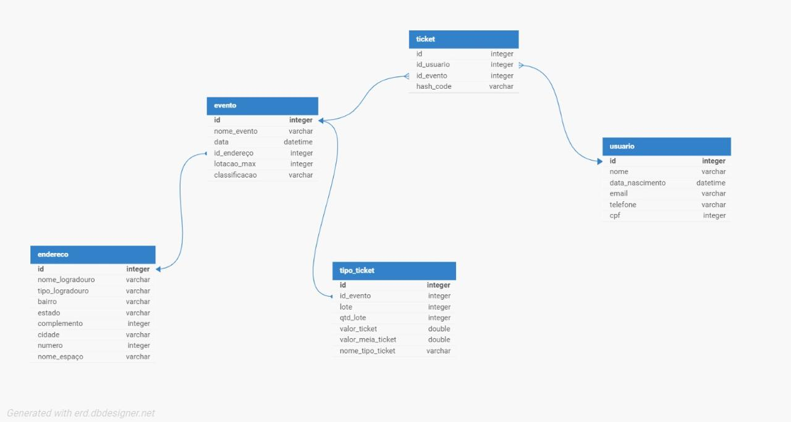

# Front-end Móvel

[Inclua uma breve descrição do projeto e seus objetivos.]

TickTag Mobile é um aplicativo focado em facilitar a compra, venda e gerenciamento de ingressos para eventos. Com uma interface intuitiva, o app permite que clientes explorem um catálogo variado de eventos, adquiram ingressos de forma rápida e segura, e mantenham o controle de suas transações em uma carteira virtual. Além disso, clientes autenticados podem atuar como organizadores, cadastrando seus próprios eventos e colocando ingressos à venda diretamente na plataforma, promovendo uma experiência colaborativa e abrangente.

## Tecnologias Utilizadas
[Lista das tecnologias principais que serão utilizadas no projeto.]

## Arquitetura

[Descrição da arquitetura das aplicação móvel, incluindo os componentes e suas interações.]

## Modelagem da Aplicação
[Descreva a modelagem da aplicação, incluindo a estrutura de dados, diagramas de classes ou entidades, e outras representações visuais relevantes.]

# Modelagem da Aplicação

A modelagem da aplicação apresentada no diagrama representa um sistema de gestão de eventos e emissão de tickets, conforme os seguintes detalhes:

## Estrutura de Dados

### **Tabela `endereco`**
- Contém informações relacionadas ao endereço onde o evento será realizado.
- **Campos principais**: 
  - `id`
  - `nome_logradouro`
  - `tipo_logradouro`
  - `bairro`
  - `cidade`
  - `estado`
  - `complemento`
  - `numero`
  - `nome_espaco`

### **Tabela `evento`**
- Armazena detalhes dos eventos cadastrados.
- **Campos principais**: 
  - `id`: identificador único do evento.
  - `nome_evento`: nome do evento.
  - `data`: data do evento.
  - `id_endereco`: chave estrangeira relacionada à tabela `endereco`.
  - `lotacao_max`: capacidade máxima de público.
  - `classificacao`: classificação indicativa do evento.

### **Tabela `tipo_ticket`**
- Define os diferentes tipos de ingressos disponíveis para cada evento.
- **Campos principais**:
  - `id`: identificador único.
  - `id_evento`: chave estrangeira relacionada à tabela `evento`.
  - `lote`: número do lote do ingresso.
  - `qtd_lote`: quantidade de ingressos no lote.
  - `valor_ticket` e `valor_meia_ticket`: valores do ingresso inteiro e meia-entrada.
  - `nome_tipo_ticket`: descrição do tipo de ingresso.

### **Tabela `ticket`**
- Representa os tickets gerados e vendidos no sistema.
- **Campos principais**:
  - `id`: identificador único.
  - `id_usuario`: chave estrangeira para o comprador (tabela `usuario`).
  - `id_evento`: chave estrangeira para o evento (tabela `evento`).
  - `hash_code`: código único gerado para autenticação do ticket.

### **Tabela `usuario`**
- Contém os dados dos usuários cadastrados no sistema.
- **Campos principais**:
  - `id`: identificador único.
  - `nome`, `data_nascimento`, `email`, `telefone`, e `cpf`: dados pessoais.

## Relacionamentos

- **`endereco` ↔ `evento`**
  - Relação de **um para muitos**: um endereço pode ser associado a vários eventos.

- **`evento` ↔ `tipo_ticket`**
  - Relação de **um para muitos**: um evento pode ter diferentes tipos de ingressos.

- **`evento` ↔ `ticket`**
  - Relação de **um para muitos**: um evento pode gerar diversos tickets.

- **`usuario` ↔ `ticket`**
  - Relação de **um para muitos**: um usuário pode adquirir vários tickets.

## Diagrama de Classes ou Entidades

O diagrama anexado reflete a estrutura de dados relacional do sistema. Ele representa as entidades principais (`endereco`, `evento`, `tipo_ticket`, `ticket`, e `usuario`), seus atributos e os relacionamentos por meio de chaves estrangeiras.

## Utilidade do Modelo

Esta modelagem suporta as funcionalidades de:
1. Cadastro de eventos com detalhes completos (data, endereço, lotação, etc.).
2. Gerenciamento de ingressos (por tipo, lote e valores).
3. Associação de tickets a eventos e usuários, garantindo a rastreabilidade por meio do `hash_code`.
4. Integração dos dados de usuários para registro e consulta de compras.

## Projeto da Interface
[Descreva o projeto da interface móvel da aplicação, incluindo o design visual, layout das páginas, interações do usuário e outros aspectos relevantes.]

O design do TickTag Mobile foi desenvolvido com foco em simplicidade, acessibilidade e funcionalidade. A interface é orientada para dispositivos móveis, garantindo que usuários possam navegar facilmente entre as principais funcionalidades do app, seja para comprar ingressos ou cadastrar eventos. O estilo de design foi mantido consistente em todas as páginas, com o uso de componentes reutilizáveis como botões, cards e inputs.

Estrutura da Interface

A interface é organizada em telas principais, cada uma com funções específicas, conectadas por uma navegação intuitiva.

Telas Principais

Login e Registro:
- Tela inicial para autenticação do usuário.
- Campos de entrada para email e senha.
- Opção para registrar-se como novo usuário.

Catálogo de Eventos:
- Lista de eventos disponíveis, com filtros.
- Visualização dos detalhes do evento com informações como data, local e descrição.

Detalhes do Evento:
- Exibição detalhada de um evento selecionado.
- Botões para favoritar ou comprar ingressos.

Carrinho e Pagamento:
- Tela de revisão dos ingressos selecionados.
- Integração de métodos de pagamento (PIX, cartão de crédito).

Carteira Virtual:
- Listagem de ingressos adquiridos pelo usuário.
- Acompanhamento do histórico de transações.

Criação de Eventos (Organizador):
- Formulário para criação de eventos, com campos como título, descrição, data, local e preço dos ingressos.
- Gestão de eventos cadastrados pelo organizador.

Perfil do Usuário:
- Tela para atualização de informações pessoais.

Suporte e Políticas:
- Seções informativas com termos de uso, política de privacidade e um formulário de contato para suporte.

## Wireframes
[Inclua os wireframes das páginas principais da interface, mostrando a disposição dos elementos na página.]

## Design Visual
[Descreva o estilo visual da interface, incluindo paleta de cores, tipografia, ícones e outros elementos gráficos.]

## Layout Responsivo
[Discuta como a interface será adaptada para diferentes tamanhos de tela e dispositivos.]

O aplicativo será desenvolvido exclusivamente para dispositivos móveis, com uma adaptação cuidadosa para diferentes tamanhos de tela, garantindo uma experiência consistente e intuitiva tanto em smartphones quanto em tablets.

Smartphones
Para smartphones, a interface será projetada com um layout vertical, priorizando a navegação fluida através de scrolling. Os elementos serão dispostos de forma linear, facilitando a leitura e a interação sequencial. A dimensão dos botões será cuidadosamente ajustada para garantir acessibilidade ao toque, minimizando a chance de toques incorretos e otimizando a usabilidade. A barra de navegação principal estará localizada na parte inferior da tela, seguindo boas práticas de design de interfaces móveis para facilitar o acesso com o polegar.

Tablets
Em tablets, a interface será adaptada para aproveitar o espaço extra disponível. O layout poderá utilizar um esquema de múltiplas colunas sempre que apropriado, especialmente em páginas de listas, como o catálogo de eventos e categorias, permitindo uma visualização mais ampla e organizada. O espaçamento entre elementos será ajustado para evitar sobrecarga visual e garantir uma apresentação clara e harmoniosa. Ícones, textos, e botões serão escalados proporcionalmente para manter a consistência visual e assegurar que a interface seja facilmente navegável, mesmo em telas maiores.

A adaptação responsiva visa garantir que o design permaneça funcional e esteticamente coerente, independentemente do dispositivo móvel utilizado. O objetivo é proporcionar uma experiência de usuário agradável, com uma navegação intuitiva e eficiente, mantendo a identidade visual do aplicativo em qualquer tamanho de tela.

## Interações do Usuário
[Descreva as interações do usuário na interface, como animações, transições entre páginas e outras interações.]

As interações foram projetadas para garantir facilidade e fluidez. Abaixo estão as principais interações esperadas:

Navegação Intuitiva: 
- O menu inferior permite acessar as principais áreas do app com um toque (Catálogo, Favoritos, Carteira, Perfil).

Toques e Gestos:
- Swipe para excluir itens do carrinho ou da lista de favoritos.
- Scroll infinito no catálogo para carregar mais eventos.

Feedback Visual:
- Animações sutis ao pressionar botões.
- Mensagens de erro ou sucesso para ações como login, compra e criação de eventos.

Confirmações: 
- Telas de confirmação antes de ações críticas, como compra de ingressos ou exclusão de eventos.

## Fluxo de Dados

[Diagrama ou descrição do fluxo de dados na aplicação.]

## Requisitos Funcionais

[Liste os principais requisitos funcionais da aplicação.]

1. Autenticação
- O sistema deve permitir que usuários façam login utilizando email e senha.
- O sistema deve permitir o registro de novos usuários com nome, email e senha.
- O sistema deve oferecer funcionalidade de recuperação de senha via email.
  
2. Gerenciamento do Perfil
- O sistema deve permitir que o usuário visualize e edite suas informações pessoais (nome, email, senha).
- O sistema deve permitir o acesso às políticas de uso e suporte.
  
3. Catálogo de Eventos
- O sistema deve exibir uma lista de eventos disponíveis, organizados em formato de cards.
- O sistema deve permitir filtrar eventos.
- O sistema deve permitir buscar eventos por palavras-chave.
- O sistema deve exibir os detalhes completos de um evento selecionado (descrição, local, data, preço).
  
4. Favoritos
- O sistema deve permitir que o usuário salve eventos como favoritos.
- O sistema deve exibir uma lista de eventos marcados como favoritos.
  
5. Compra de Ingressos
- O sistema deve permitir que o usuário adicione ingressos ao carrinho.
- O sistema deve permitir que o usuário escolha a quantidade e tipo de ingressos.
- O sistema deve processar pagamentos utilizando PIX ou cartão de crédito.
- O sistema deve exibir confirmação após a compra.
  
6. Carteira Virtual
- O sistema deve exibir uma lista de ingressos comprados, organizados por status (ativos, expirados).
- O sistema deve permitir que o usuário visualize os detalhes dos ingressos adquiridos.
  
7. Criação de Eventos
- O sistema deve permitir que usuários autenticados criem eventos, inserindo informações como título, descrição, data, local e preço.
- O sistema deve permitir que o organizador gerencie eventos criados (editar e excluir).
  
8. Suporte
- O sistema deve permitir que o usuário envie mensagens para a equipe de suporte via formulário.
- O sistema deve exibir informações de contato e termos de uso.

## Requisitos Não Funcionais

[Liste os principais requisitos não funcionais da aplicação, como desempenho, segurança, escalabilidade, etc.]

1. Usabilidade
- O aplicativo deve ser intuitivo e fácil de navegar, com interações claras e design amigável.
- O sistema deve fornecer feedback imediato para as ações do usuário (ex.: carregando, sucesso, erro).
- A interface deve ser responsiva e funcionar em diferentes tamanhos de tela (smartphones e tablets de diversas resoluções).

2. Desempenho
- O aplicativo deve carregar o catálogo de eventos em menos de 3 segundos em uma conexão de internet estável.
- As transações de pagamento devem ser processadas em menos de 5 segundos.

3. Segurança
- O sistema deve criptografar todas as informações sensíveis, como senhas e dados de pagamento.
- O sistema deve garantir que apenas usuários autenticados possam criar eventos ou visualizar ingressos comprados.
- O sistema deve implementar proteção contra ataques comuns, como SQL Injection e Cross-Site Scripting (XSS).

4. Escalabilidade
- O backend do sistema deve ser projetado para suportar um aumento de carga (mais eventos, usuários e transações) sem impacto significativo no desempenho.
- O sistema deve ser capaz de adicionar novas funcionalidades sem grandes mudanças na arquitetura.

5. Disponibilidade
- O sistema deve ter uma disponibilidade de 99,9%, minimizando períodos de inatividade.
- O sistema deve permitir recuperação rápida em caso de falhas (tempo de recuperação menor que 1 hora).

6. Compatibilidade
- O aplicativo deve ser compatível com sistemas operacionais Android (versão 8.0 ou superior) e iOS (versão 13 ou superior).

7. Mantenabilidade
- O código do sistema deve seguir boas práticas de desenvolvimento (e.g., Clean Code).
- O sistema deve utilizar uma arquitetura modular para facilitar correções e atualizações.

## Considerações de Segurança

[Discuta as considerações de segurança relevantes para a aplicação distribuída, como autenticação, autorização, proteção contra ataques, etc.]

## Implantação

[Instruções para implantar a aplicação distribuída em um ambiente de produção.]

1. Defina os requisitos de hardware e software necessários para implantar a aplicação em um ambiente de produção.
2. Escolha uma plataforma de hospedagem adequada, como um provedor de nuvem ou um servidor dedicado.
3. Configure o ambiente de implantação, incluindo a instalação de dependências e configuração de variáveis de ambiente.
4. Faça o deploy da aplicação no ambiente escolhido, seguindo as instruções específicas da plataforma de hospedagem.
5. Realize testes para garantir que a aplicação esteja funcionando corretamente no ambiente de produção.

## Testes

[Descreva a estratégia de teste, incluindo os tipos de teste a serem realizados (unitários, integração, carga, etc.) e as ferramentas a serem utilizadas.]

1. Crie casos de teste para cobrir todos os requisitos funcionais e não funcionais da aplicação.
2. Implemente testes unitários para testar unidades individuais de código, como funções e classes.
3. Realize testes de integração para verificar a interação correta entre os componentes da aplicação.
4. Execute testes de carga para avaliar o desempenho da aplicação sob carga significativa.
5. Utilize ferramentas de teste adequadas, como frameworks de teste e ferramentas de automação de teste, para agilizar o processo de teste.

## Referências

Inclua todas as referências (livros, artigos, sites, etc) utilizados no desenvolvimento do trabalho.
