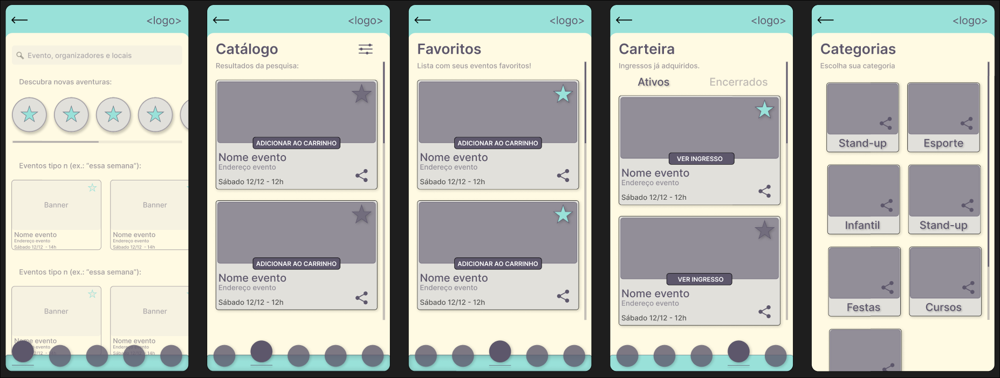
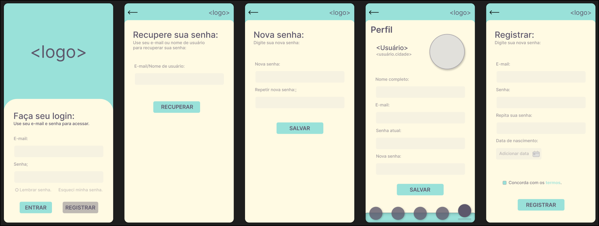
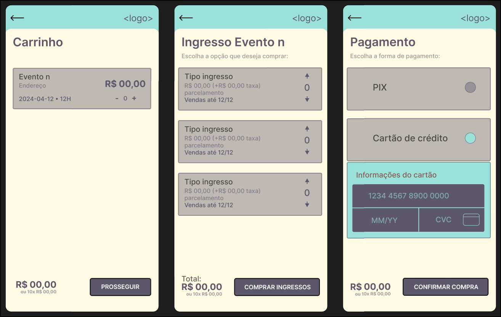
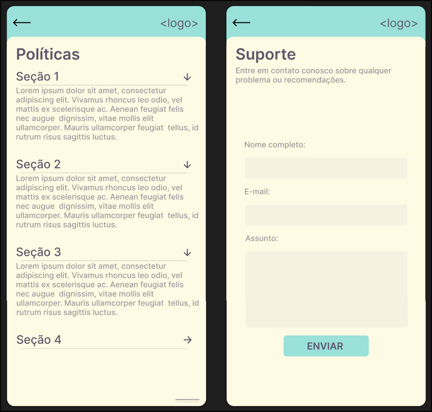

# Front-end Móvel
TickTag Mobile é um aplicativo focado em facilitar a compra, venda e gerenciamento de ingressos para eventos. Com uma interface intuitiva, o app permite que clientes explorem um catálogo variado de eventos, adquiram ingressos de forma rápida e segura, e mantenham o controle de suas transações em uma carteira virtual. Além disso, clientes autenticados podem atuar como organizadores, cadastrando seus próprios eventos e colocando ingressos à venda diretamente na plataforma, promovendo uma experiência colaborativa e abrangente.


## Tecnologias Utilizadas 
No desenvolvimento deste projeto, foram empregadas as seguintes tecnologias:

- React Native: Framework para desenvolvimento de aplicações móveis multiplataforma, permitindo a criação de interfaces nativas para Android e iOS com JavaScript.
- Expo Go: Ferramenta que simplifica o desenvolvimento com React Native, facilitando a visualização em tempo real das alterações e o acesso a bibliotecas específicas.
- Axios: Biblioteca utilizada para realizar requisições HTTP, garantindo a integração entre o aplicativo e as APIs necessárias.

## Arquitetura

A aplicação móvel foi desenvolvida utilizando uma arquitetura modular e escalável, visando organizar os componentes de forma clara e eficiente. Os principais elementos e suas interações estão descritos abaixo:

### Componentes da Arquitetura
**1. Interface do Usuário (UI)**
- Desenvolvida com React Native, utilizando componentes reutilizáveis e estilizações customizadas.
- Navegação implementada por meio de bibliotecas específicas, como React Navigation, garantindo uma experiência fluida.

**2. Comunicação com APIs**
- Realizada com a biblioteca Axios, responsável por executar requisições HTTP (GET, POST, PUT, DELETE) a serviços remotos.
- O tratamento de respostas inclui manipulação de erros e conversão dos dados para formatos compatíveis com a aplicação.

### Fluxo de Interação
- O usuário interage com a Interface do Usuário (UI), disparando eventos que atualizam o estado global ou local.
- Os dados são requisitados do backend por meio de serviços encapsulados na camada de comunicação.
- As respostas são tratadas e exibidas na interface, garantindo uma experiência consistente e responsiva.

## Modelagem da Aplicação

A modelagem da aplicação apresentada no diagrama representa um sistema de gestão de eventos e emissão de tickets, conforme os seguintes detalhes:

### Estrutura de Dados


### **Tabela `endereco`**
- Contém informações relacionadas ao endereço onde o evento será realizado.
- **Campos principais**: 
  - `id`
  - `nome_logradouro`
  - `tipo_logradouro`
  - `bairro`
  - `cidade`
  - `estado`
  - `complemento`
  - `numero`
  - `nome_espaco`

### **Tabela `evento`**
- Armazena detalhes dos eventos cadastrados.
- **Campos principais**: 
  - `id`: identificador único do evento.
  - `nome_evento`: nome do evento.
  - `data`: data do evento.
  - `id_endereco`: chave estrangeira relacionada à tabela `endereco`.
  - `lotacao_max`: capacidade máxima de público.
  - `classificacao`: classificação indicativa do evento.

### **Tabela `tipo_ticket`**
- Define os diferentes tipos de ingressos disponíveis para cada evento.
- **Campos principais**:
  - `id`: identificador único.
  - `id_evento`: chave estrangeira relacionada à tabela `evento`.
  - `lote`: número do lote do ingresso.
  - `qtd_lote`: quantidade de ingressos no lote.
  - `valor_ticket` e `valor_meia_ticket`: valores do ingresso inteiro e meia-entrada.
  - `nome_tipo_ticket`: descrição do tipo de ingresso.

### **Tabela `ticket`**
- Representa os tickets gerados e vendidos no sistema.
- **Campos principais**:
  - `id`: identificador único.
  - `id_usuario`: chave estrangeira para o comprador (tabela `usuario`).
  - `id_evento`: chave estrangeira para o evento (tabela `evento`).
  - `hash_code`: código único gerado para autenticação do ticket.

### **Tabela `usuario`**
- Contém os dados dos usuários cadastrados no sistema.
- **Campos principais**:
  - `id`: identificador único.
  - `nome`, `data_nascimento`, `email`, `telefone`, e `cpf`: dados pessoais.

### Relacionamentos

- **`endereco` ↔ `evento`**
  - Relação de **um para muitos**: um endereço pode ser associado a vários eventos.

- **`evento` ↔ `tipo_ticket`**
  - Relação de **um para muitos**: um evento pode ter diferentes tipos de ingressos.

- **`evento` ↔ `ticket`**
  - Relação de **um para muitos**: um evento pode gerar diversos tickets.

- **`usuario` ↔ `ticket`**
  - Relação de **um para muitos**: um usuário pode adquirir vários tickets.

### Diagrama de Classes ou Entidades

O diagrama acima reflete a estrutura de dados relacional do sistema. Ele representa as entidades principais (`endereco`, `evento`, `tipo_ticket`, `ticket`, e `usuario`), seus atributos e os relacionamentos por meio de chaves estrangeiras.

### Utilidade do Modelo

Esta modelagem suporta as funcionalidades de:
1. Cadastro de eventos com detalhes completos (data, endereço, lotação, etc.).
2. Gerenciamento de ingressos (por tipo, lote e valores).
3. Associação de tickets a eventos e usuários, garantindo a rastreabilidade por meio do `hash_code`.
4. Integração dos dados de usuários para registro e consulta de compras.

## Projeto da Interface
O design do TickTag Mobile foi desenvolvido com foco em simplicidade, acessibilidade e funcionalidade. A interface é orientada para dispositivos móveis, garantindo que usuários possam navegar facilmente entre as principais funcionalidades do app, seja para comprar ingressos ou cadastrar eventos. O estilo de design foi mantido consistente em todas as páginas, com o uso de componentes reutilizáveis como botões, cards e inputs.

Estrutura da Interface

A interface é organizada em telas principais, cada uma com funções específicas, conectadas por uma navegação intuitiva.

Telas Principais

Login e Registro:
- Tela inicial para autenticação do usuário.
- Campos de entrada para email e senha.
- Opção para registrar-se como novo usuário.

Catálogo de Eventos:
- Lista de eventos disponíveis, com filtros.
- Visualização dos detalhes do evento com informações como data, local e descrição.

Detalhes do Evento:
- Exibição detalhada de um evento selecionado.
- Botões para favoritar ou comprar ingressos.

Carrinho e Pagamento:
- Tela de revisão dos ingressos selecionados.
- Integração de métodos de pagamento (PIX, cartão de crédito).

Carteira Virtual:
- Listagem de ingressos adquiridos pelo usuário.
- Acompanhamento do histórico de transações.

Criação de Eventos (Organizador):
- Formulário para criação de eventos, com campos como título, descrição, data, local e preço dos ingressos.
- Gestão de eventos cadastrados pelo organizador.

Perfil do Usuário:
- Tela para atualização de informações pessoais.

Suporte e Políticas:
- Seções informativas com termos de uso, política de privacidade e um formulário de contato para suporte.

## Wireframes

### Homepage; Catálogo; Favoritos e Carteira e seus respectivos componentes


### Login; Recuperar senha; Nova senha; Perfil; Registrar;


### Cadastro de Evento; Visualização de Evento `n`


### Carrinho; Ingressos; Pagamento


### Políticas; Contato suporte


## Design Visual
Seguindo o estilo visual da versão web. A interface tem um visual moderno e direto, usando cores neutras como base e um tom vibrante para destacar botões e links importantes. A tipografia sans-serif garante uma leitura fácil, enquanto ícones do Font Awesome orientam as ações do usuário. Elementos gráficos simples, com bordas sutis e espaçamento organizado, deixam a navegação leve e intuitiva em qualquer dispositivo.

## Layout Responsivo
O aplicativo será desenvolvido exclusivamente para dispositivos móveis, com uma adaptação cuidadosa para diferentes tamanhos de tela, garantindo uma experiência consistente e intuitiva tanto em smartphones quanto em tablets.

Smartphones
Para smartphones, a interface será projetada com um layout vertical, priorizando a navegação fluida através de scrolling. Os elementos serão dispostos de forma linear, facilitando a leitura e a interação sequencial. A dimensão dos botões será cuidadosamente ajustada para garantir acessibilidade ao toque, minimizando a chance de toques incorretos e otimizando a usabilidade. A barra de navegação principal estará localizada na parte inferior da tela, seguindo boas práticas de design de interfaces móveis para facilitar o acesso com o polegar.

Tablets
Em tablets, a interface será adaptada para aproveitar o espaço extra disponível. O layout poderá utilizar um esquema de múltiplas colunas sempre que apropriado, especialmente em páginas de listas, como o catálogo de eventos e categorias, permitindo uma visualização mais ampla e organizada. O espaçamento entre elementos será ajustado para evitar sobrecarga visual e garantir uma apresentação clara e harmoniosa. Ícones, textos, e botões serão escalados proporcionalmente para manter a consistência visual e assegurar que a interface seja facilmente navegável, mesmo em telas maiores.

A adaptação responsiva visa garantir que o design permaneça funcional e esteticamente coerente, independentemente do dispositivo móvel utilizado. O objetivo é proporcionar uma experiência de usuário agradável, com uma navegação intuitiva e eficiente, mantendo a identidade visual do aplicativo em qualquer tamanho de tela.


## Interações do Usuário
As interações foram projetadas para garantir facilidade e fluidez. Abaixo estão as principais interações esperadas:

Navegação Intuitiva: 
- O menu inferior permite acessar as principais áreas do app com um toque (Catálogo, Favoritos, Carteira, Perfil).

Toques e Gestos:
- Swipe para excluir itens do carrinho ou da lista de favoritos.
- Scroll infinito no catálogo para carregar mais eventos.

Feedback Visual:
- Animações sutis ao pressionar botões.
- Mensagens de erro ou sucesso para ações como login, compra e criação de eventos.

Confirmações: 
- Telas de confirmação antes de ações críticas, como compra de ingressos ou exclusão de eventos.

## Fluxo de Dados

A modelagem reflete o fluxo de dados atualizado entre as entidades principais, garantindo que o endereço seja vinculado diretamente ao evento.

### **1. Cadastro de Eventos**
- O fluxo inicia com o cadastro do evento na tabela `evento`.
- Informações cadastradas:
  - Nome do evento.
  - Data e hora.
  - Capacidade máxima de público (`lotacao_max`).
  - Classificação indicativa (`classificacao`).
- O evento recebe um identificador único (`id`), que será usado em outras tabelas.

### **2. Registro de Endereços**
- Após o evento ser cadastrado, é associado a ele um endereço por meio da tabela `endereco`.
- Cada endereço recebe o identificador do evento (`id_evento`), criando um vínculo direto.
- Informações cadastradas:
  - Nome e tipo do logradouro.
  - Bairro, cidade, estado e número.
  - Nome do espaço onde o evento será realizado.

### **3. Configuração de Tipos de Tickets**
- Com o evento registrado, são configurados os tipos de tickets na tabela `tipo_ticket`.
- Cada tipo de ticket é vinculado ao evento por meio da chave estrangeira `id_evento`.
- Informações cadastradas:
  - Número do lote (`lote`).
  - Quantidade disponível no lote (`qtd_lote`).
  - Valores de entrada (inteira e meia-entrada).
  - Descrição do tipo de ticket (ex.: "VIP", "Pista").

### **4. Registro de Usuários**
- Os usuários são cadastrados com informações como:
  - Nome completo.
  - Data de nascimento.
  - E-mail, telefone e CPF.
- Cada usuário recebe um identificador único (`id`), que será utilizado na emissão de tickets.

### **5. Emissão de Tickets**
- Os tickets são gerados e armazenados na tabela `ticket`, vinculados a:
  - Um usuário (chave estrangeira `id_usuario`).
  - Um evento específico (chave estrangeira `id_evento`).
- Informações cadastradas:
  - Um código de autenticação único (`hash_code`), que identifica o ticket de forma segura.
- Este processo garante que cada ticket seja rastreável, vinculando o comprador ao evento correspondente.

---

### Representação Visual do Fluxo

```markdown
# Fluxo 1: Acesso e Cadastro de Usuário

[Home]  
 ├──> [Login]  
 │      ├──> [Recuperar Senha] -> [Nova Senha] -> [Login]  
 │      └──> [Registrar] -> [Perfil]  
 │  
 └──> [Categorias] -> [Lista de Eventos por Categoria n] -> [Evento n]

---

# Fluxo 2: Exploração de Eventos

[Home] -> [Catálogo] -> [Evento n] -> [Ver opções de compra] -> [Ingressos Evento n] -> [Carrinho] -> [Pagamento]

*Do Catálogo, o usuário pode filtrar, buscar e navegar por eventos. Ao selecionar um evento, segue para ver detalhes, ingressos e concluir compra.*

---

# Fluxo 3: Favoritos

[Home] -> [Catálogo] -> [Evento n] -> [Adicionar aos Favoritos] -> [Favoritos]

*Usuário marca evento como favorito e depois acessa a lista de favoritos.*

---

# Fluxo 4: Carteira de Ingressos

[Home] -> [Carteira]  
              ├──> [Ativos] -> [Ver Ingresso]  
              └──> [Encerrados]

*Usuário visualiza ingressos já adquiridos, ativos ou encerrados.*

---

# Fluxo 5: Políticas e Suporte

[Home] -> [Políticas] -> [Seção 1 / Seção 2 / Seção 3 / Seção 4]  
[Home] -> [Suporte] -> [Formulário de Contato] -> [Enviar]

*Usuário pode visualizar políticas do app e contatar o suporte através de um formulário.*

---

# Fluxo 6: Criação e Edição de Evento (Organizador)

[Home] -> [Criar Evento]  
             ├──> [Adicionar Data/Horário]  
             ├──> [Adicionar Endereço]  
             ├──> [Adicionar Ingressos]  
             └──> [Salvar Evento]

*Se o usuário for um organizador, pode criar e editar eventos, adicionando detalhes e ingressos.*

---

# Fluxo 7: Editar Perfil

[Home] -> [Perfil] -> [Editar dados: Nome, E-mail, Senha, etc.] -> [Salvar]

*Usuário pode atualizar suas informações de perfil.*

---

# Fluxo Resumido

[Home]  
 ├──> [Login] -> [Registrar] -> [Perfil]  
 │      └──> [Recuperar Senha] -> [Nova Senha]  
 ├──> [Catálogo] -> [Evento n] -> [Opções de compra] -> [Ingressos Evento n] -> [Carrinho] -> [Pagamento]  
 │        ├──> [Favoritos]  
 │        └──> [Categorias] -> [Lista Evento Categoria n] -> [Evento n]  
 ├──> [Carteira] -> [Ativos/Encerrados]  
 ├──> [Políticas]  
 ├──> [Suporte] -> [Formulário de Contato]  
 └──> [Criar Evento] -> [Configuração de Data/Endereço/Ingressos] -> [Salvar]

---

```

### Fluxo Detalhado

1. **Registro de Usuários:**  
   Os usuários são cadastrados inicialmente para que possam acessar o aplicativo, realizar login e, se for o caso, criar ou adquirir ingressos de eventos.

2. **Criação de Evento (Organizador):**  
   Organizadores criam eventos dentro do sistema, definindo informações básicas como título, descrição e data.

3. **Associação ao Endereço:**  
   Cada evento é associado a um endereço, determinando localidade e detalhes de onde ocorrerá.

4. **Configuração de Ingressos (Tickets):**  
   Para cada evento, são definidos tipos e quantidades de ingressos, valores e disponibilidade.

5. **Emissão e Aquisição de Ingressos:**  
   Após a configuração, os ingressos podem ser adquiridos pelos usuários. Cada ingresso é então vinculado a um usuário específico, garantindo a rastreabilidade e acesso ao evento.


## Requisitos Funcionais
1. Autenticação
- O sistema deve permitir que usuários façam login utilizando email e senha.
- O sistema deve permitir o registro de novos usuários com nome, email e senha.
- O sistema deve oferecer funcionalidade de recuperação de senha via email.
  
2. Gerenciamento do Perfil
- O sistema deve permitir que o usuário visualize e edite suas informações pessoais (nome, email, senha).
- O sistema deve permitir o acesso às políticas de uso e suporte.
  
3. Catálogo de Eventos
- O sistema deve exibir uma lista de eventos disponíveis, organizados em formato de cards.
- O sistema deve permitir filtrar eventos.
- O sistema deve permitir buscar eventos por palavras-chave.
- O sistema deve exibir os detalhes completos de um evento selecionado (descrição, local, data, preço).
  
4. Favoritos
- O sistema deve permitir que o usuário salve eventos como favoritos.
- O sistema deve exibir uma lista de eventos marcados como favoritos.
  
5. Compra de Ingressos
- O sistema deve permitir que o usuário adicione ingressos ao carrinho.
- O sistema deve permitir que o usuário escolha a quantidade e tipo de ingressos.
- O sistema deve processar pagamentos utilizando PIX ou cartão de crédito.
- O sistema deve exibir confirmação após a compra.
  
6. Carteira Virtual
- O sistema deve exibir uma lista de ingressos comprados, organizados por status (ativos, expirados).
- O sistema deve permitir que o usuário visualize os detalhes dos ingressos adquiridos.
  
7. Criação de Eventos
- O sistema deve permitir que usuários autenticados criem eventos, inserindo informações como título, descrição, data, local e preço.
- O sistema deve permitir que o organizador gerencie eventos criados (editar e excluir).
  
8. Suporte
- O sistema deve permitir que o usuário envie mensagens para a equipe de suporte via formulário.
- O sistema deve exibir informações de contato e termos de uso.

## Requisitos Não Funcionais
1. Usabilidade
- O aplicativo deve ser intuitivo e fácil de navegar, com interações claras e design amigável.
- O sistema deve fornecer feedback imediato para as ações do usuário (ex.: carregando, sucesso, erro).
- A interface deve ser responsiva e funcionar em diferentes tamanhos de tela (smartphones e tablets de diversas resoluções).

2. Desempenho
- O aplicativo deve carregar o catálogo de eventos em menos de 3 segundos em uma conexão de internet estável.
- As transações de pagamento devem ser processadas em menos de 5 segundos.

3. Segurança
- O sistema deve criptografar todas as informações sensíveis, como senhas e dados de pagamento.
- O sistema deve garantir que apenas usuários autenticados possam criar eventos ou visualizar ingressos comprados.
- O sistema deve implementar proteção contra ataques comuns, como SQL Injection e Cross-Site Scripting (XSS).

4. Escalabilidade
- O backend do sistema deve ser projetado para suportar um aumento de carga (mais eventos, usuários e transações) sem impacto significativo no desempenho.
- O sistema deve ser capaz de adicionar novas funcionalidades sem grandes mudanças na arquitetura.

5. Disponibilidade
- O sistema deve ter uma disponibilidade de 99,9%, minimizando períodos de inatividade.
- O sistema deve permitir recuperação rápida em caso de falhas (tempo de recuperação menor que 1 hora).

6. Compatibilidade
- O aplicativo deve ser compatível com sistemas operacionais Android (versão 8.0 ou superior) e iOS (versão 13 ou superior).

7. Mantenabilidade
- O código do sistema deve seguir boas práticas de desenvolvimento (e.g., Clean Code).
- O sistema deve utilizar uma arquitetura modular para facilitar correções e atualizações.

## Considerações de Segurança

### **Medidas de Segurança Implementadas no Aplicativo Mobile**

Durante o desenvolvimento do aplicativo mobile utilizando **React Native com Expo**, foram adotadas diversas práticas e ferramentas de segurança para proteger os dados dos usuários e garantir a integridade do sistema. As medidas implementadas estão detalhadas a seguir:

---

#### **1. Armazenamento Seguro de Dados Sensíveis**  
- Utilizamos o **SecureStore**, fornecido pelo Expo, para o armazenamento seguro de dados sensíveis, como tokens de autenticação. Essa solução garante a criptografia dos dados localmente.  
- Minimização do uso de dados persistentes no dispositivo, preferindo buscar informações diretamente do backend quando necessário.

---

#### **2. Comunicação Segura com APIs**  
- Todas as requisições ao backend são realizadas por meio de **HTTPS**, garantindo que os dados em trânsito estejam protegidos contra interceptações.  
- Implementamos **tokens de autenticação** do tipo JWT (JSON Web Tokens), configurados com expiração e rotação para reduzir riscos de exposição.  
- Utilizamos o **Axios** para gerenciar as requisições HTTP, configurando interceptors para tratar erros, como expiração de tokens, e reforçando as mensagens de erro para não expor informações sensíveis.

---

#### **3. Gerenciamento de Chaves e Segredos**  
- Todas as chaves de API e segredos foram armazenados em variáveis de ambiente utilizando o **Secrets Manager** do Expo, evitando sua exposição no código-fonte.  
- Foram configuradas chaves separadas para cada ambiente (desenvolvimento, homologação e produção), assegurando uma maior organização e controle.

---

#### **4. Prevenção contra Engenharia Reversa**  
- O código JavaScript foi ofuscado utilizando ferramentas como **Metro Config** e **React Native Obfuscator**, dificultando a análise por engenharia reversa.  
- No Android, ativamos o **Proguard** para minimizar e ofuscar o código nativo gerado, reforçando a proteção do aplicativo.

---

#### **5. Segurança de Dados em Trânsito**  
- Implementamos **Certificate Pinning** utilizando bibliotecas como **react-native-cert-pinner**, protegendo a comunicação com o backend contra ataques de intermediário (MITM).  
- Configuramos validações de headers e parâmetros no backend para evitar injeções de dados maliciosos.

---

#### **6. Controle de Permissões**  
- O aplicativo solicita apenas as permissões estritamente necessárias, como câmera e localização, em conformidade com as políticas da Google Play Store e App Store.  
- As permissões foram gerenciadas utilizando as APIs do Expo, com mensagens claras ao usuário sobre os motivos de cada solicitação.

---

#### **7. Atualizações e Verificação de Dependências**  
- Realizamos atualizações regulares de todas as dependências, incluindo React Native, Expo e Axios, garantindo a eliminação de vulnerabilidades conhecidas.  
- Utilizamos ferramentas como **npm audit** e **Snyk** para identificar e corrigir possíveis vulnerabilidades em pacotes de terceiros.

---

#### **8. Prevenção contra Captura de Tela e Clonagem**  
- Implementamos a restrição de capturas de tela em áreas que exibem dados sensíveis, utilizando **react-native-screens** para plataformas Android e iOS.  
- Configuramos verificações de integridade para assegurar que o aplicativo não fosse executado em ambientes não autorizados ou clonado.

---

#### **9. Logs e Debugging**  
- Configuramos o sistema de logs para não registrar dados sensíveis em produção, prevenindo a exposição de informações confidenciais.  
- Garantimos que o **debug mode** e ferramentas de depuração, como o Flipper, estejam desativadas em builds de produção.

---

#### **10. Monitoramento e Resposta**  
- Integramos a ferramenta **Sentry** para monitorar o desempenho do aplicativo e capturar exceções em tempo real, permitindo identificar e responder rapidamente a falhas de segurança.  
- Definimos um plano de contingência para atualizações emergenciais, possibilitando a distribuição de correções críticas com agilidade.

## Implantação

### **Processo de Implantação do Aplicativo Mobile**

O processo de implantação do aplicativo mobile desenvolvido com **React Native utilizando Expo** foi realizado de forma estruturada, aproveitando as ferramentas e serviços disponíveis na plataforma para garantir uma publicação eficiente e confiável. A seguir, descrevemos as etapas envolvidas:

---

#### **1. Configuração do Projeto para Produção**  
- O aplicativo foi configurado para o ambiente de produção utilizando o **Expo Application Services (EAS)**, que oferece suporte para builds otimizados e controle de configurações específicas para Android e iOS.  
- Os arquivos de configuração `app.json` e `eas.json` foram ajustados para incluir informações como ícones, splash screens, permissões e variáveis de ambiente apropriadas para a versão final.  
- Certificados e credenciais necessários para publicação, como chaves de assinatura do Android e perfis de provisionamento do iOS, foram gerenciados pelo Expo.

---

#### **2. Otimização do Aplicativo**  
- Realizamos a minimização e obfuscação do código para reduzir o tamanho final do aplicativo e dificultar a engenharia reversa.  
- Removemos dependências e recursos não utilizados para garantir uma aplicação mais leve e rápida.  

---

#### **3. Build do Aplicativo**  
- Utilizamos o **EAS Build** para gerar as builds de produção para ambas as plataformas (Android e iOS). Esse serviço permitiu configurar e executar builds na nuvem, otimizando o processo de criação de APKs e arquivos IPA.  
- Foram geradas versões de **APK (Android Package)** para Android e **IPA (iOS App Store Package)** para iOS, garantindo compatibilidade com as diretrizes de ambas as lojas.

---

#### **4. Publicação na Google Play Store e App Store**  
- **Google Play Store**:  
  - O APK gerado foi enviado para o Google Play Console.  
  - Configuramos a descrição do aplicativo, capturas de tela, políticas de privacidade e outros detalhes obrigatórios.  
  - O aplicativo foi submetido ao processo de revisão e aprovado para publicação.  

- **App Store (iOS)**:  
  - O arquivo IPA foi carregado no App Store Connect utilizando o **Transporter** ou via upload direto pelo EAS.  
  - Foram preenchidas todas as informações exigidas, incluindo capturas de tela, classificação etária e políticas de privacidade.  
  - Após revisão, o aplicativo foi aprovado e disponibilizado na App Store


## Testes

[Descreva a estratégia de teste, incluindo os tipos de teste a serem realizados (unitários, integração, carga, etc.) e as ferramentas a serem utilizadas.]

1. Crie casos de teste para cobrir todos os requisitos funcionais e não funcionais da aplicação.
2. Implemente testes unitários para testar unidades individuais de código, como funções e classes.
3. Realize testes de integração para verificar a interação correta entre os componentes da aplicação.
4. Execute testes de carga para avaliar o desempenho da aplicação sob carga significativa.
5. Utilize ferramentas de teste adequadas, como frameworks de teste e ferramentas de automação de teste, para agilizar o processo de teste.

## Referências

Inclua todas as referências (livros, artigos, sites, etc) utilizados no desenvolvimento do trabalho.
