# Front-end Web

O aplicativo web de venda de tickets é projetado para proporcionar uma experiência simples e eficiente na compra de ingressos para eventos. O app permitirá que os usuários visualizem eventos disponíveis, selecionem ingressos, realizem pagamentos de forma segura e recebam ingressos digitais. O objetivo é criar uma plataforma responsiva que ofereça uma navegação intuitiva para os compradores de ingressos, além de fornecer ferramentas para os organizadores gerenciarem eventos e acompanhar vendas.

## Tecnologias Utilizadas

- ReactJS: Biblioteca principal para construção da interface do usuário, oferecendo uma estrutura de componentes reativa e modular.
- React Router: Gerencia a navegação e o roteamento dentro da aplicação, permitindo transições de páginas sem recarregar.
- Context API: Utilizada junto com React para gerenciar o estado global de autenticação, facilitando o controle de login, logout e proteção de rotas.
- Bootstrap: Framework CSS que fornece uma base responsiva e moderna, utilizado junto com estilos personalizados para uma aparência consistente e adaptável.
- EmailJS: Serviço de envio de e-mails utilizado para o formulário de contato, permitindo enviar mensagens sem um backend dedicado.
- LocalStorage: Usado para armazenar o token de autenticação do usuário, garantindo persistência da sessão mesmo após o recarregamento da página.
- Fetch API: Realiza requisições HTTP para a API backend, com funções CRUD para criar, ler, atualizar e deletar dados.
- JWT (JSON Web Token): Utilizado para autenticação segura, validando o acesso do usuário com base em tokens.
- Dotenv: Carrega variáveis de ambiente (.env), permitindo configurar URLs e outros parâmetros de forma dinâmica conforme o ambiente de execução (ex.: desenvolvimento ou produção).
- Font Awesome: Biblioteca de ícones usada para adicionar ícones visuais e melhorar a usabilidade da interface.

## Arquitetura

A aplicação é estruturada como uma SPA (Single Page Application), ou seja, toda a navegação acontece em uma única página, sem recarregar o site a cada clique. Isso deixa a experiência mais rápida e fluida para o usuário. A aplicaçǎo foi organizada da seguinte maneira: 

1- Estrutura Principal: 

- App é o componente principal que organiza toda a aplicação. Ele contém as rotas e envolve os componentes Navbar e Footer, que aparecem em todas as páginas. A navegação entre páginas é gerenciada pelo React Router.

2- Roteamento e Autenticação:

- Rotas Públicas: Incluem páginas que qualquer pessoa pode acessar, como Home, Catalogo, Evento, Login, Register, Contato e Politica.

- Rotas Privadas: São protegidas e só podem ser acessadas por quem está logado. Páginas como CriarEvento e Carrinho são protegidas por um componente especial chamado PrivateRoute, que redireciona para o login caso o usuário não esteja autenticado.

- AuthContext: Gerencia o login, logout e mantém o usuário autenticado enquanto navega. Ele usa o token JWT, armazenado no localStorage, para garantir que o usuário continue logado mesmo ao atualizar a página.

3- Componentização: 

- Cada parte do site é um componente separado, como Navbar, Footer, FiltroEventos, CartaoEvento, entre outros. Isso facilita a manutenção e reutilização do código em diferentes partes da aplicação.

4- Comunicação com a API: 

- Todas as requisições ao backend (login, registro, criação de eventos) passam por um módulo central chamado apiService. Ele é responsável por configurar cabeçalhos, incluir o token JWT e tratar erros de forma centralizada.

- JWT: O token JWT é usado para proteger as rotas e garantir que só usuários autenticados possam acessar áreas restritas.

5- Funcionalidades Principais:

- Autenticação: O AuthContext gerencia o login e logout. O usuário faz login e recebe um token, que é usado para acessar rotas protegidas.

- Listagem e Filtros: Na página Catalogo, o usuário pode ver eventos e usar filtros para refinar a busca. A busca acontece de forma dinâmica, com requisições para a API a cada ajuste nos filtros.

- Compra de Ingressos: Na página Evento, o usuário seleciona o tipo de ingresso, define a quantidade e vê o valor total antes de finalizar a compra.

6- Estilo e Layout:

- A aplicação usa Bootstrap para garantir um layout responsivo que se adapta a diferentes telas, como celulares e computadores.
Estilos adicionais são aplicados via CSS customizado para manter uma identidade visual única.


## Modelagem da Aplicação

- Eventos: Inclui detalhes como nome, data, local, capacidade, ingressos disponíveis e preço.
- Ingressos: Tipo de ingresso, quantidade disponível, valor unitário e descontos.
- Usuários: Informações dos compradores (nome, e-mail, histórico de compras).
- Pedidos: Detalhes das compras, status de pagamento e geração dos ingressos digitais.

Essas entidades serão representadas como objetos JavaScript manipulados pelo estado da aplicação

## Projeto da Interface Web

O projeto da interface será focado na usabilidade e simplicidade. As principais páginas incluem:

1. Design Visual

- Estilo Geral: Limpo e moderno, com uso de cores neutras e destaques em botões e links para facilitar a navegação.

- Paleta de Cores: A paleta é composta de tons neutros (cinza e branco) com uma cor de destaque (como azul ou verde) para botões e elementos interativos.

- Tipografia: Utiliza fontes sans-serif para uma leitura agradável e simples. Cabeçalhos e títulos são destacados, enquanto o corpo do texto é claro e fácil de ler.

- Ícones: A interface utiliza ícones do Font Awesome para guiar o usuário, como ícones de ingressos, usuário, carrinho, etc., que aumentam a compreensão e interação.

2. Layout das Páginas

- Cabeçalho (Navbar): Exibe links de navegação para as páginas principais (Home, Catálogo, Contato, Login, Registro). O cabeçalho é fixo no topo e ajusta-se conforme o tamanho da tela.

- Rodapé (Footer): Contém links rápidos para políticas de privacidade e contato, além dos ícones de redes sociais.

- Página Inicial (Home):

Objetivo: Apresentar a aplicação e os eventos principais.
Conteúdo: Destaques de eventos populares ou recomendados e uma breve descrição da plataforma.
Interações: Links para o catálogo e outros eventos destacados, incentivando o usuário a explorar mais.

- Catálogo de Eventos:

Objetivo: Exibir todos os eventos disponíveis.
Layout: Grade de cartões com uma breve descrição de cada evento, incluindo imagem, data, local e um botão “Saiba Mais”.
Interações: Filtros na lateral (por data, classificação etária, localização, etc.) para refinar os resultados. A lista de eventos atualiza automaticamente com base nos filtros selecionados.

- Detalhes do Evento:

Objetivo: Exibir as informações detalhadas de um evento específico.
Conteúdo: Nome, data e hora, local, descrição completa, tipos de ingressos e lotação.
Interações: Seletor de ingresso e quantidade, com atualização do valor total. Botão de “Comprar Agora” que leva ao processo de compra.

- Carrinho:

Objetivo: Exibir os ingressos que o usuário selecionou.
Layout: Tabela com detalhes do ingresso, quantidade e valor total.
Interações: Opções para alterar a quantidade ou remover itens, e botão para prosseguir com o pagamento.

- Login e Registro:

Objetivo: Permitir que o usuário faça login ou crie uma nova conta.
Layout: Formulários simples, com campos para e-mail e senha. A página de registro inclui campos adicionais, como nome e data de nascimento.
Interações: Mensagens de erro em caso de problemas na autenticação, como senha incorreta ou e-mail já registrado.

- Criar Evento (acessível para organizadores):

Objetivo: Permitir que organizadores cadastrem novos eventos.
Conteúdo: Formulário com campos detalhados para o nome do evento, data, local, descrição e tipos de ingressos.
Interações: Opção para fazer upload de uma imagem para a capa do evento. Botão para salvar e publicar o evento.

4. Responsividade

A interface foi projetada com Bootstrap e CSS customizado para garantir que o layout se ajuste automaticamente em dispositivos móveis, tablets e desktops.

## Wireframes
[Inclua os wireframes das páginas principais da interface, mostrando a disposição dos elementos na página.]

### Página Inicial

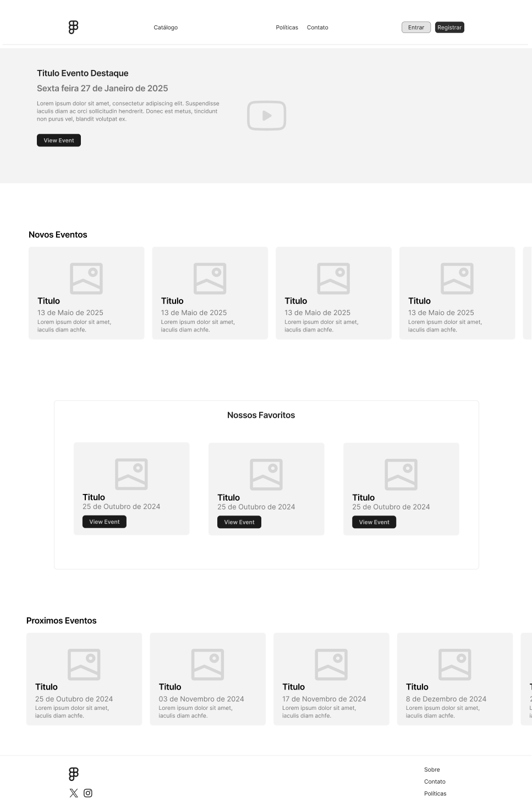

### Catálogo de Tickets 

Esta é a página de catálogo, onde os usuários podem navegar por diferentes eventos disponíveis para compra de ingressos. Na lateral esquerda, há um painel de filtros para facilitar a pesquisa do usuário. Cada item do catálogo é exibido em formato de card, com uma imagem do evento, título, lotação maxima, status e classificação etária além de endereço data.

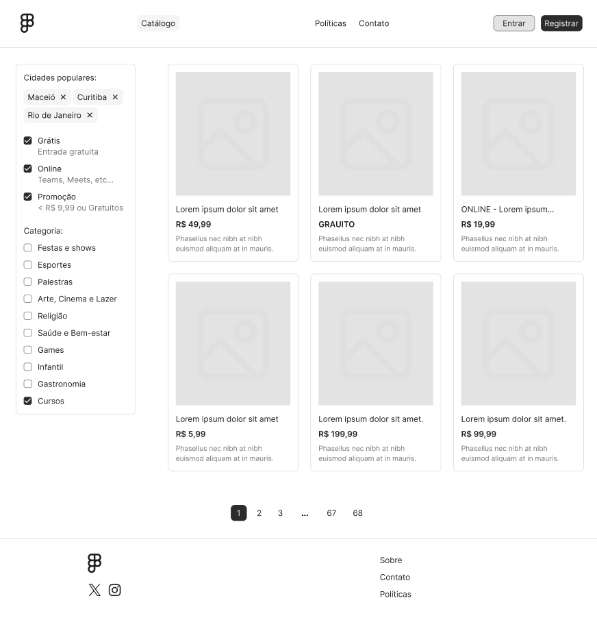

### Detalhes do Evento

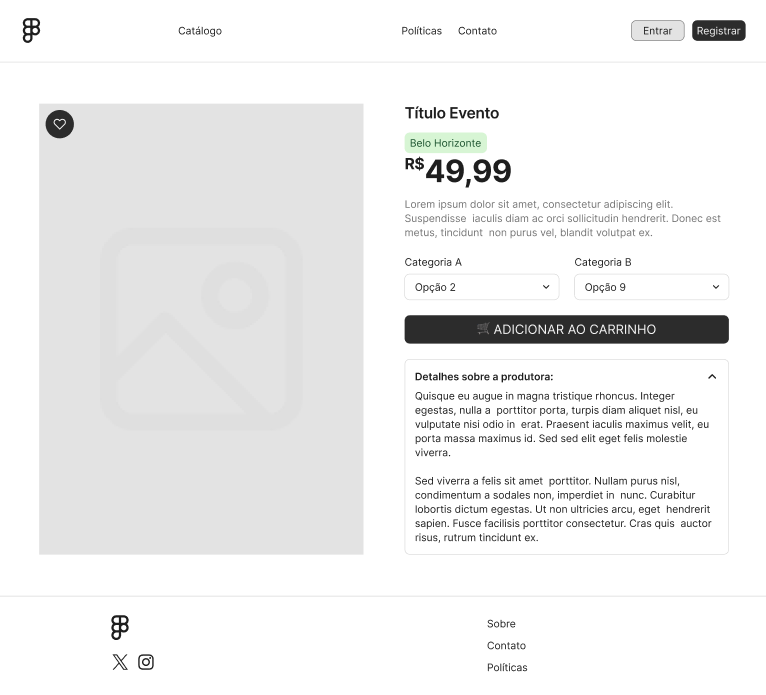

### Registro

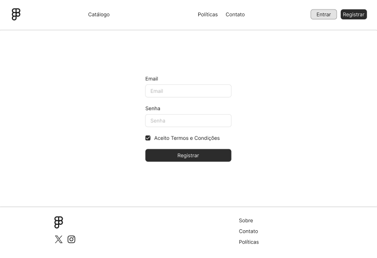

### Perfil

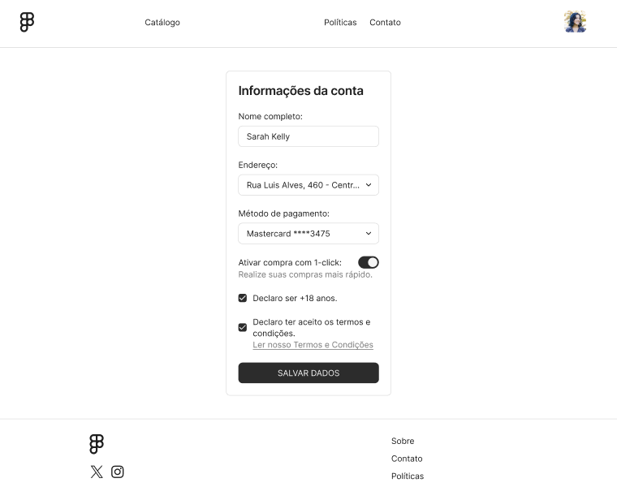

### Contato

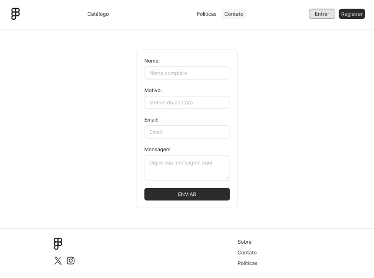

### Politicas de Privacidade

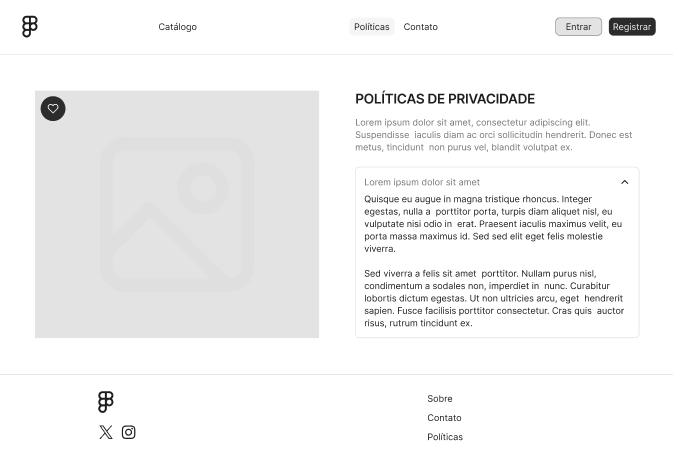

## Design Visual

A interface tem um visual moderno e direto, usando cores neutras como base e um tom vibrante para destacar botões e links importantes. A tipografia sans-serif garante uma leitura fácil, enquanto ícones do Font Awesome orientam as ações do usuário. Elementos gráficos simples, com bordas sutis e espaçamento organizado, deixam a navegação leve e intuitiva em qualquer dispositivo.

### Layout Responsivo

A interface se adapta a diferentes telas usando Bootstrap e media queries, organizando os elementos em colunas em desktops e empilhando-os em dispositivos móveis. O menu se transforma em "hambúrguer" no mobile, e imagens e textos ajustam-se para manter a legibilidade em qualquer tamanho de tela.

## Interações do Usuário

A interface traz transições suaves entre páginas e animações discretas para botões e ícones. Ao adicionar itens ao carrinho ou fazer login, o usuário vê mensagens de confirmação. Campos de formulário destacam-se ao focar, e o menu se expande com toque no mobile.

## Fluxo de Dados

O fluxo de dados começa com o usuário enviando uma solicitação, como login, consulta de eventos ou compra de ingressos. A aplicação faz requisições à API, que retorna dados ou confirmações. Informações do usuário, como autenticação e itens no carrinho, são gerenciadas pelo Context API e armazenadas no localStorage para persistência. Os dados fluem entre os componentes via props e Context API, garantindo sincronização em toda a interface.

## Requisitos Funcionais

1- Exibir lista de eventos com filtros por data, local e tipo de evento.

2- Permitir cadastro e login de usuários.

3- Exibir detalhes de um evento específico, incluindo ingressos disponíveis.

4- Adicionar ingressos ao carrinho e atualizar quantidade.

5- Realizar compra de ingressos com cálculo de valor total.

6- Permitir criação e gerenciamento de eventos (para organizadores).

7- Enviar confirmações e mensagens de erro ao usuário em cada ação.

## Requisitos Não Funcionais

1-Desempenho: Carregar páginas e dados de forma rápida, especialmente para listas de eventos e carrinho.

2- Segurança: Proteger dados do usuário com autenticação JWT e armazenamento seguro de senhas.

3- Escalabilidade: Suportar aumento no número de usuários e eventos sem perda de desempenho.

4- Usabilidade: Interface intuitiva e responsiva para navegação fácil em diferentes dispositivos.

5- Disponibilidade: Garantir que a aplicação esteja acessível continuamente, com baixo tempo de inatividade.

6- Manutenção: Código modular e organizado para facilitar atualizações e correções.

## Considerações de Segurança


1- Autenticação e Autorização: Uso de JWT (JSON Web Tokens) para autenticar usuários e garantir acesso apenas a áreas autorizadas, como o gerenciamento de eventos.

2- Proteção de Dados: Criptografia de senhas no banco de dados para proteger informações sensíveis.

3- Armazenamento Seguro: Tokens de autenticação são armazenados de forma segura no localStorage, e acessos críticos utilizam HTTPS para criptografar dados em trânsito.

4- Proteção contra Ataques: Implementação de medidas contra ataques comuns, como SQL Injection e Cross-Site Scripting (XSS), validando entradas e sanitizando dados.

5- Limitação de Sessão: Expiração automática de tokens para prevenir acessos não autorizados em caso de sessões prolongadas ou comprometidas.

6- Controle de Acesso: Restrição de rotas específicas para organizadores, garantindo que apenas usuários autorizados possam criar e gerenciar eventos.


## Implantação

A aplicação **Ticket-Tag** foi implantada em um ambiente de produção usando **Render.com**, com Docker para o backend e NGINX para servir o frontend. O banco de dados **PostgreSQL** também foi configurado na plataforma Render, integrando-se ao backend. Abaixo está o resumo do processo de implantação:

### 1. Requisitos de Hardware e Software

- **Backend**: Configurado em uma instância Docker adequada para executar a aplicação em Node.js e o framework Spring, ajustando RAM e armazenamento para suportar a carga esperada.
- **Banco de Dados**: Configurado usando **PostgreSQL** como serviço em Render, permitindo integração direta e segura com o backend.
- **Frontend**: Configurado para ser servido via **NGINX** em um contêiner Docker separado, após build do projeto React.

### 2. Configuração no Render

- **Backend**: Configurado como serviço Web Service no Render, usando o Dockerfile personalizado para build e execução da aplicação. Variáveis de ambiente, como `DATABASE_URL` e `JWT_SECRET`, foram definidas diretamente no painel do Render para atender aos requisitos de produção.
  
- **Frontend**: O frontend React foi compilado em uma imagem Docker leve com **NGINX**. O Dockerfile define o processo de build em uma imagem Node.js e serve o aplicativo via NGINX. O comando `npm run build` foi utilizado para gerar o diretório `build/`, que foi copiado para o diretório do NGINX para servir a aplicação na porta 80.

- **Exemplo do Dockerfile do Frontend**:
  
  ```dockerfile
  # Use a imagem base do Node.js
  FROM node:17-alpine AS build

  # Defina o diretório de trabalho
  WORKDIR /app

  # Copie o package.json e o package-lock.json
  COPY package*.json ./

  # Instale as dependências
  RUN npm install

  # Copie o restante do código
  COPY . .

  # Compile o projeto
  RUN npm run build

  # Use uma imagem leve para servir a aplicação
  FROM nginx:alpine

  # Copie os arquivos de build para o NGINX
  COPY --from=build /app/build /usr/share/nginx/html

  # Exponha a porta 80
  EXPOSE 80

  # Comando para iniciar o NGINX
  CMD ["nginx", "-g", "daemon off;"]
  ```

- **Banco de Dados**: PostgreSQL foi configurado em Render, e a variável `DATABASE_URL` foi disponibilizada para o backend, permitindo conexão segura e direta com o banco.

### 3. Configuração de Ambiente e Dependências

- **Variáveis de Ambiente**: O `REACT_APP_API_URL` no frontend foi configurado para apontar ao URL do backend em produção (`https://ticktag-bxlk.onrender.com`), assegurando que todas as requisições do frontend sejam direcionadas corretamente.

  ```plaintext
  REACT_APP_API_URL=https://ticktag-bxlk.onrender.com
  ```

- **Dependências**: Dependências do frontend foram gerenciadas via `npm install`, enquanto o backend usou as dependências listadas no Dockerfile e foram automaticamente gerenciadas durante o build.

### 4. Deploy e Testes

- **Backend**: Render realizou o build automático das imagens Docker para backend e frontend conforme o Dockerfile. Logs foram revisados para assegurar que o deploy ocorreu sem erros.
- **Frontend**: O frontend foi testado acessando a URL pública gerada pelo Render para confirmar que a SPA React carregava corretamente e se comunicava com o backend.
- **Banco de Dados**: O backend foi validado para acessar o PostgreSQL com operações CRUD, confirmando a comunicação com o banco de dados.

### 5. Validação Final em Produção

- **Teste de Funcionalidade**: Testes de usabilidade foram realizados para garantir que as rotas principais e funcionalidades, como login e navegação, estavam operacionais.
- **Testes de Integração**: O fluxo de dados entre frontend, backend e banco de dados foi verificado para assegurar comunicação confiável.
- **Testes de Segurança**: A autenticação JWT e o armazenamento seguro de tokens foram validados, permitindo que apenas usuários autenticados acessassem rotas protegidas.
- **Teste de Escalabilidade**: A aplicação foi submetida a múltiplas requisições simultâneas para garantir desempenho adequado sob alta demanda.


## Testes


### 1. Catálogo

### 1.1 Testes Unitários

#### Teste Cartao Evento:

Este teste assegura que o componente CartaoEvento exibe corretamente as informações principais do evento, incluindo nome, cidade e endereço, na interface do usuário.

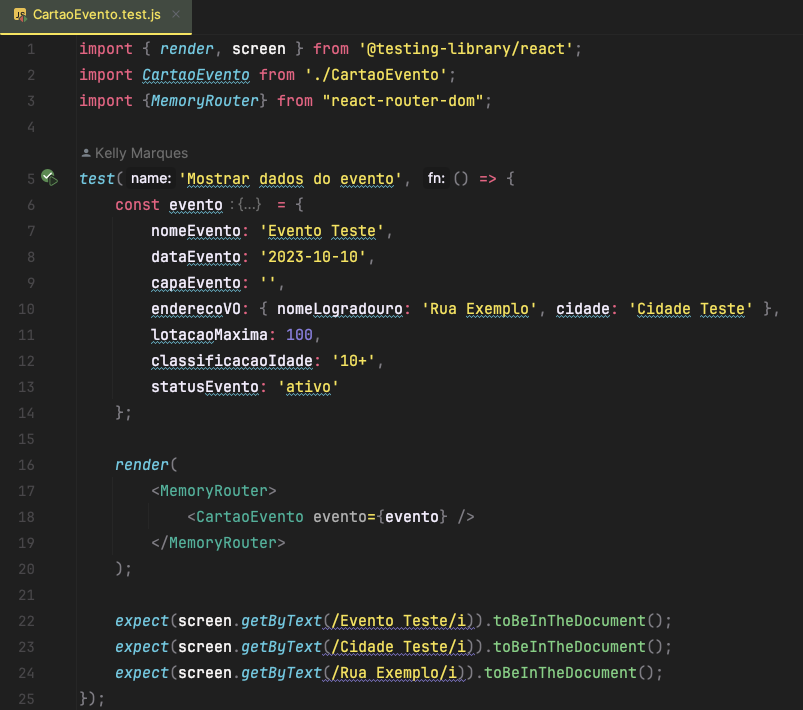


Teste de Renderização e Interatividade do Componente FiltroEventos:

Este teste verifica se o componente FiltroEventos renderiza corretamente os filtros com seus respectivos rótulos e se chama o método onApply ao clicar no botão de aplicação dos filtros.

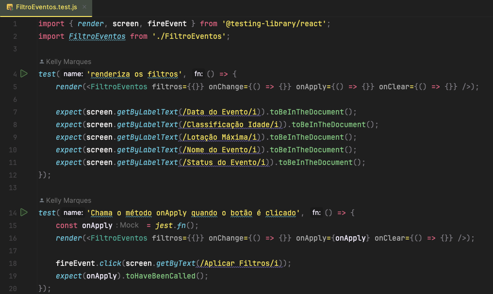


Teste de Renderização do Componente ListaEventos:

Este teste verifica se o componente ListaEventos renderiza corretamente os cartões de eventos, exibindo informações básicas, como o nome do evento, conforme esperado na interface.

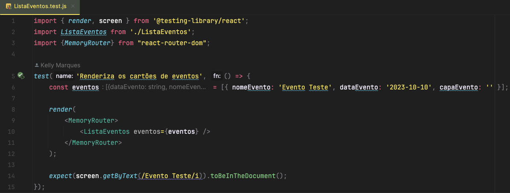

Teste de Aplicação de Filtro de Data no Componente Catalogo:

Este teste verifica se o componente Catalogo aplica corretamente um filtro de data, chamando a função fetchPublicData com os parâmetros esperados e exibindo apenas os eventos que correspondem ao filtro aplicado.

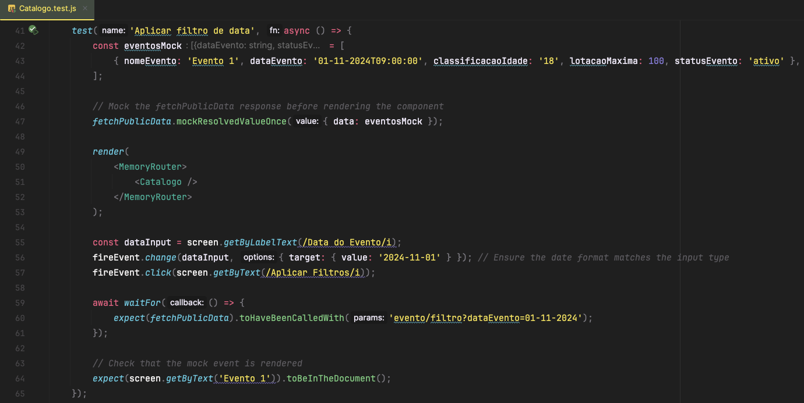


### 1.2 Testes de Integração

#### Teste de Aplicação de Múltiplos Filtros e Resultados no Componente Catalogo.

Esses testes verificam:

A aplicação de múltiplos filtros, como "Classificação de Idade" e "Status", garantindo que fetchPublicData seja chamado com os parâmetros corretos e que os eventos correspondentes sejam exibidos.
O comportamento quando filtros são aplicados sem resultados correspondentes, confirmando que a mensagem "Nenhum evento encontrado" é exibida quando nenhum evento atende aos critérios.

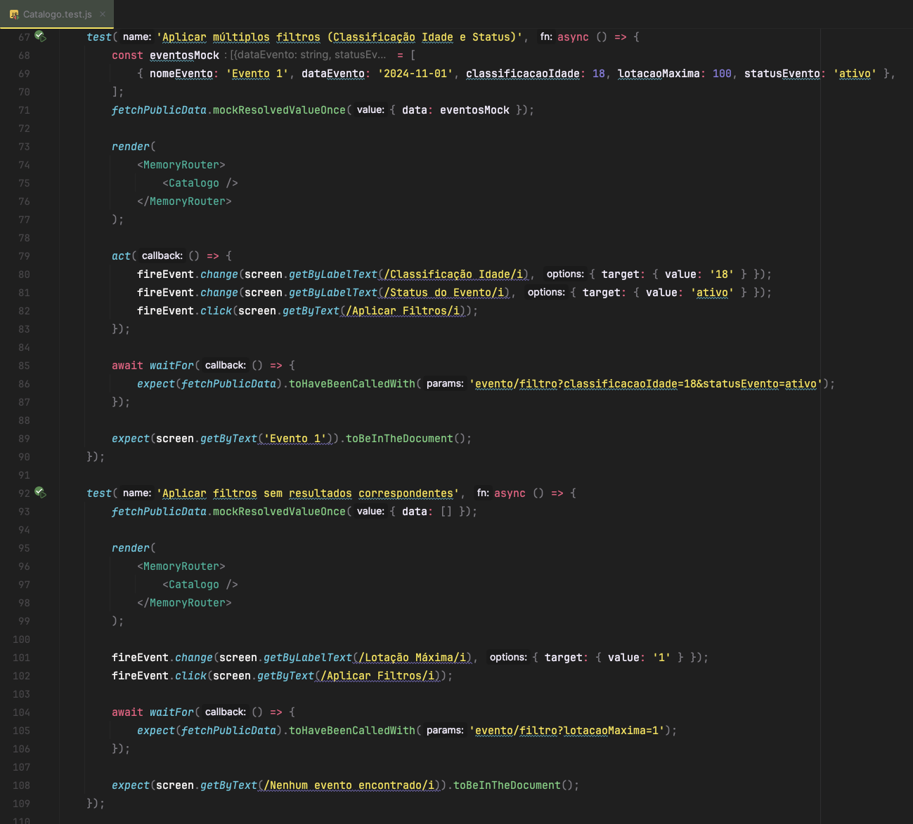

Teste de Aplicação e Limpeza de Filtros no Componente Catalogo

Este teste valida a funcionalidade de aplicar e limpar filtros no componente `Catalogo`. Ele verifica se, ao aplicar o filtro de "Status" (definido como "ativo"), apenas os eventos correspondentes são exibidos, e se, ao limpar os filtros, todos os eventos retornam à lista. O teste assegura que as chamadas para `fetchPublicData` são feitas com os parâmetros corretos em cada etapa.

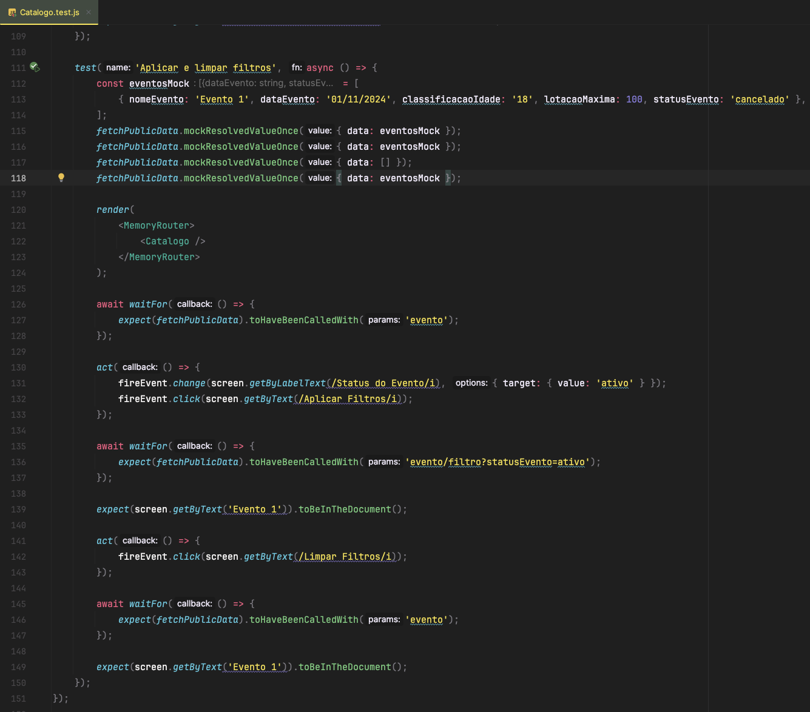

# Referências

  -
